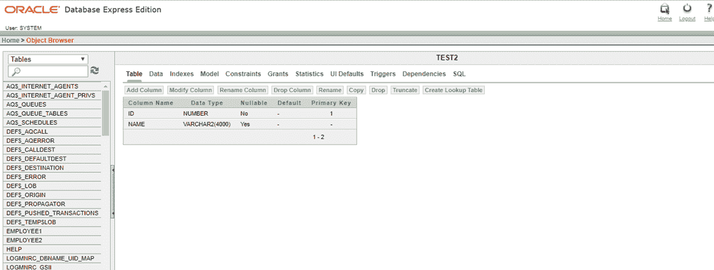
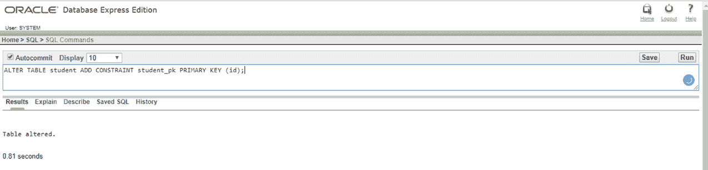
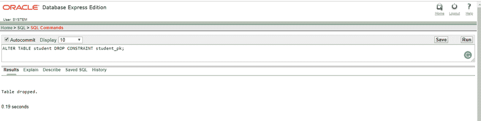
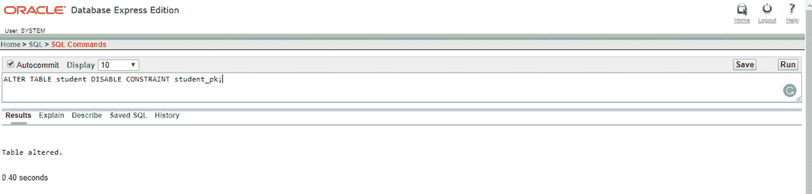
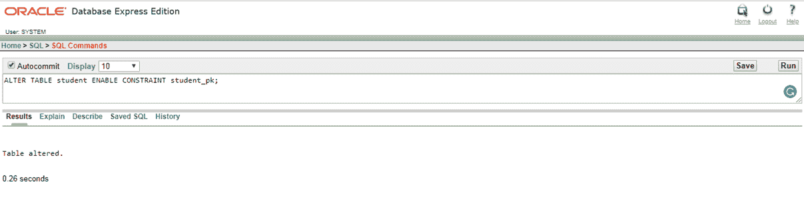

# 主关键字

> 原文：<https://www.javatpoint.com/primary-key-in-oracle>

在 Oracle 中，主键是具有唯一值的列，不能为空。在表中，只能有一个主键。

## 主键-使用创建表语句

## 语法:

```

CREATE TABLE table_name
(
  column1 datatype null/not null,
  column2 datatype null/not null,
  ...
  CONSTRAINT constraint_name PRIMARY KEY (column1, column2, ... column_n)
);

```

## 例子

```

CREATE TABLE Test2(ID Number, NAME Varchar2 CONSTRAINT test2_pk PRIMARY KEY (ID));

```



* * *

## 主键-使用 ALTER TABLE 语句

## 语法:

```

ALTER TABLE table_name
ADD CONSTRAINT constraint_name PRIMARY KEY (column1, column2, ... column_n);

```

## 例子

```

ALTER TABLE student ADD CONSTRAINT student_pk PRIMARY KEY(id);

```



## 删除主键

## 语法:

```

ALTER TABLE table_name
DROP CONSTRAINT constraint_name;

```

## 例子

```

ALTER TABLE student DROP CONSTRAINT student_pk ;

```



## 禁用主键

## 语法:

```

ALTER TABLE table_name
DISABLE CONSTRAINT constraint_name;

```

## 例子

```

ALTER TABLE student DISABLE CONSTRAINT student_pk ;

```



## 启用主键

## 语法:

```

ALTER TABLE table_name
ENABLE CONSTRAINT constraint_name;

```

## 例子

```

ALTER TABLE student ENABLE CONSTRAINT student_pk ;

```

