# 卡珊德拉安装和安装

> 原文：<https://www.javatpoint.com/cassandra-setup-and-installation>

Apache Cassandra 和 Datastax 企业被不同的组织用来存储大量的数据。

在安装 Apache Cassandra 之前，您必须具备以下条件:

*   您必须拥有 datastax 社区版。你可以下载卡珊德拉[点击这里](https://cassandra.apache.org/download/)
*   必须安装 JDK。
*   平台应该是窗口。

* * *

## 下载并安装卡珊德拉

遵循以下步骤:

*   运行 datastax 社区版安装程序。运行安装程序后，您会看到将显示以下页面。这是 64 位版本的截图。
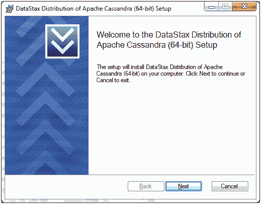

*   点击下一步按钮，您将看到以下页面:
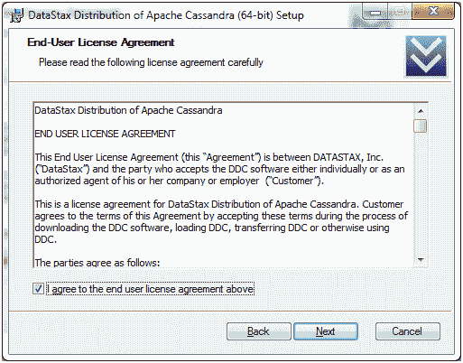

*   按下“下一步”按钮，您将看到指定安装位置的下一页。
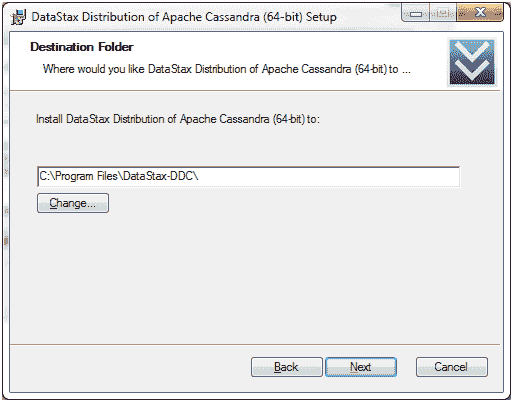

*   按下“下一步”按钮，将出现一个页面，询问您是否自动启动 Data Stax DDC 服务。单击单选按钮，然后继续。
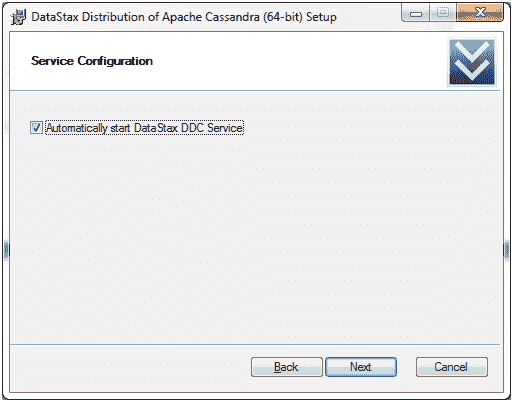

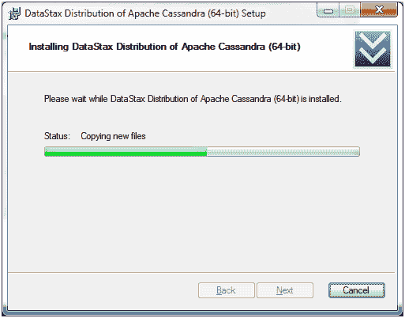

*   安装现在开始。安装完成后，转到安装 Data Stax 的程序文件。
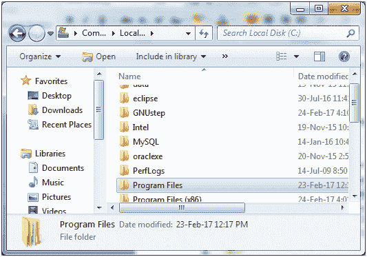

*   打开程序文件，然后您会看到以下页面:
*   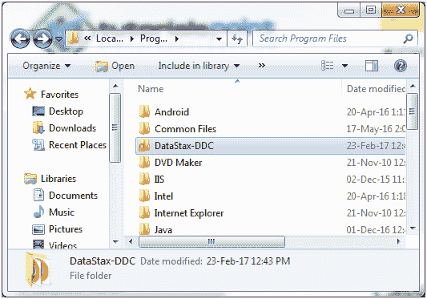

*   打开数据税-DDC，然后你会看到 Apache Cassandra:
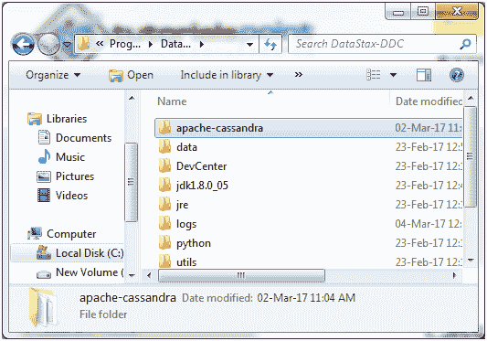

*   打开 Apache Cassandra，您会看到 bin:
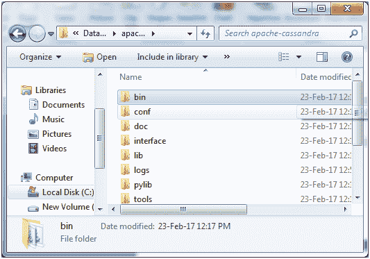

*   打开垃圾箱，你会看到卡珊德拉窗口批处理文件:
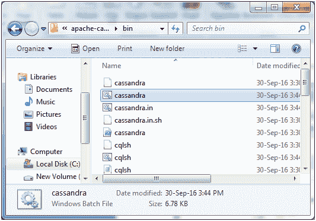

*   运行此文件。它将启动 Cassandra 服务器，您将看到以下页面:
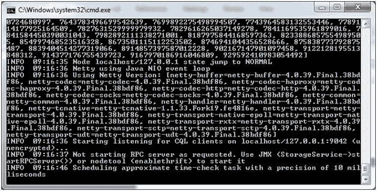

*   服务器已启动现在转到 windows 开始程序，搜索卡珊德拉 CQL 外壳
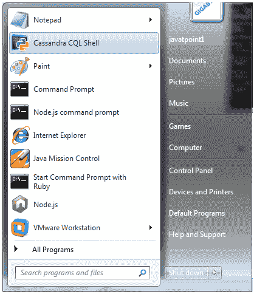

*   运行卡珊德拉外壳。运行 Cassandra shell 后，您将看到以下命令行:
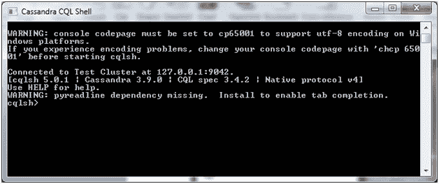

* * *