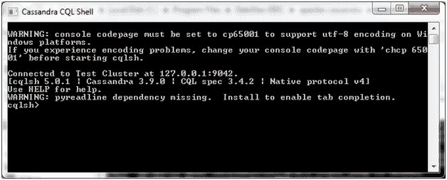

# 卡珊德拉 CQLsh

> 原文：<https://www.javatpoint.com/cassandra-cqlsh>

卡珊德拉 CQLsh 代表卡珊德拉 CQL 贝壳。CQLsh 指定如何使用 Cassandra 命令。安装后，Cassandra 提供一个提示性的 Cassandra 查询语言 shell (cqlsh)。它方便用户与它交流。

Cassandra 命令在 CQLsh 上执行。看起来是这样的:

**启动 CQLsh:**

CQLsh 提供了许多选项，如下表所示:

| 选择 | 使用 |
| 帮助 | 此命令用于显示关于 CQLsh 命令选项的帮助主题。 |
| 版本 | 它用于查看您正在使用的 CQLsh 的版本。 |
| 颜色 | 它用于彩色输出。 |
| 调试 | 它显示附加的调试信息。 |
| 执行 | 它用于指示 shell 接受并执行 CQL 命令。 |
| file= "文件名" | 通过使用该选项，cassandra 执行给定文件中的命令并退出。 |
| 无色 | 它指示卡珊德拉不要使用彩色输出。 |
| 用户名 | 使用此选项，您可以对用户进行身份验证。默认用户名是:cassandra。 |
| 密码 | 使用此选项，您可以使用密码对用户进行身份验证。默认密码是:cassandra。 |

* * *