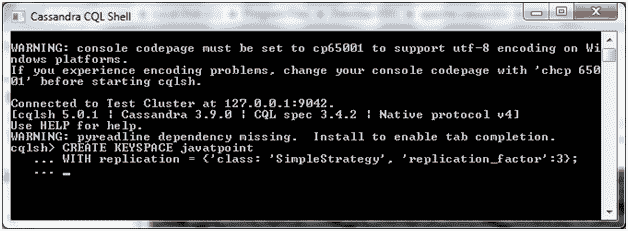
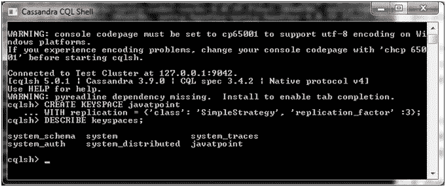
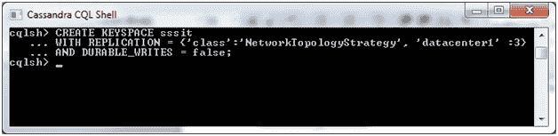
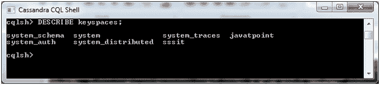
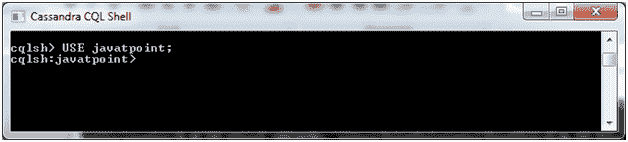

# Cassandra 创建密钥空间

> 原文：<https://www.javatpoint.com/cassandra-create-keyspace>

Cassandra 查询语言(CQL)方便开发者与 Cassandra 交流。Cassandra 查询语言的语法与 SQL 非常相似。

* * *

## 什么是密钥空间？

键空间是用于保存列族、用户定义类型的对象。键空间类似于 RDBMS 数据库，它包含列族、索引、用户定义的类型、数据中心感知、键空间中使用的策略、复制因子等。

在 Cassandra 中，“创建键空间”命令用于创建键空间。

**语法:**

```

CREATE KEYSPACE <identifier> WITH <properties> 

```

或者

```

Create keyspace KeyspaceName with replicaton={'class':strategy name, 
'replication_factor': No of replications on different nodes} 

```

* * *

## Cassandra·凯斯空间的不同组成部分

**策略:**Cassandra 语法中有两种类型的策略声明:

*   **简单策略:**简单策略用于一个数据中心的情况。在此策略中，第一个副本放置在选定的节点上，其余节点在环中以顺时针方向放置，不考虑机架或节点位置。
*   **网络拓扑策略:**该策略用于多个数据中心的情况。在此策略中，您必须为每个数据中心分别提供复制因子。

**复制因子:**复制因子是放置在不同节点上的数据副本的数量。两个以上的复制因子对于实现无单点故障是很好的。所以，3 是很好的复制因子。

**示例:**

让我们举一个例子来创建一个名为“javatpoint”的键空间。

```

CREATE KEYSPACE javatpoint
WITH replication = {'class':'SimpleStrategy', 'replication_factor' : 3}; 

```



现在创建了密钥空间。

## 验证:

要检查键空间是否已创建，请使用“description”命令。通过使用此命令，您可以看到创建的所有键空间。



在 Cassandra 中还有 CREATE KEYSPACE 的另一个属性。

* * *

## 持久写入

默认情况下，表的持久写入属性设置为真，您也可以将此属性设置为假。但是，该属性不能设置为单纯策略。

**示例:**

让我们举一个例子来看看耐久 _write 属性的用法。

```

CREATE KEYSPACE sssit
WITH REPLICATION = { 'class' : 'NetworkTopologyStrategy', 'datacenter1' : 3 }
 AND DURABLE_WRITES = false;

```



* * *

## 验证:

要检查键空间是否已创建，请使用“description”命令。通过使用此命令，您可以看到创建的所有键空间。



* * *

## 使用键空间

要使用创建的键空间，必须使用 use 命令。

**语法:**

```

USE <identifier>

```

**见本例:**

这里，我们使用 javatpoint 键空间。



* * *