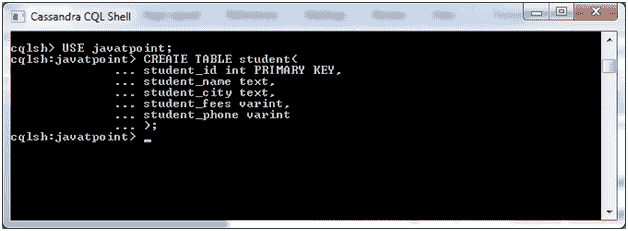
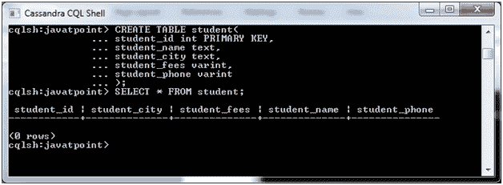

# 卡珊德拉创建表格

> 原文：<https://www.javatpoint.com/cassandra-create-table>

在 Cassandra 中，CREATE TABLE 命令用于创建一个表。这里，列族用于存储数据，就像关系数据库中的表一样。

因此，您可以说 CREATE TABLE 命令用于在 Cassandra 中创建一个柱族。

**语法:**

```
CREATE (TABLE | COLUMNFAMILY) <tablename>
('<column-definition>' , '<column-definition>')
(WITH <option> AND <option>) 

```

**或**

**用于声明主键:**

```
CREATE TABLE tablename(
   column1 name datatype PRIMARYKEY,
   column2 name data type,
   column3 name data type.
   )

```

**也可以使用以下语法定义主键:**

```
Create table TableName
(
ColumnName DataType,
ColumnName DataType,
ColumnName DataType
.
.
.
Primary key(ColumnName)
) with PropertyName=PropertyValue; 

```

主键有两种类型:

*   **单主键:**对单主键使用以下语法。

```
Primary key (ColumnName) 

```

*   **复合主键:**对单个主键使用以下语法。

```
Primary key(ColumnName1,ColumnName2 . . .)  

```

**示例:**

让我们举个例子来演示 CREATE TABLE 命令。

这里，我们使用已经创建的 Keyspace“javatpoint”。

```
CREATE TABLE student(
   student_id int PRIMARY KEY,
   student_name text,
   student_city text,
   student_fees varint,
   student_phone varint
   ); 

```



现在创建了该表。您可以使用以下命令进行检查。

```
SELECT * FROM student;

```



* * *