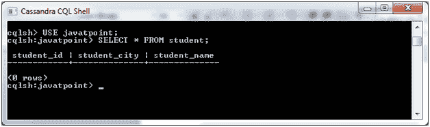
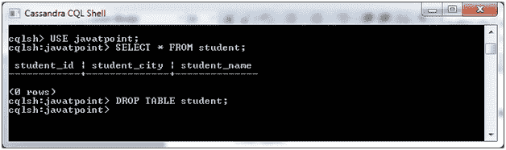
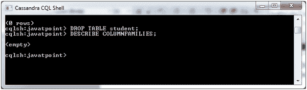

# Cassandra DROP 表

> 原文：<https://www.javatpoint.com/cassandra-drop-table>

DROP TABLE 命令用于删除一个表。

**语法:**

```

DROP TABLE <tablename> 

```

**示例:**

让我们举个例子来演示如何删除一个表。这里，我们放下学生桌。

**前表:**



**使用以下命令后:**

```

DROP TABLE student; 

```



名为“学生”的表现在被删除。您可以使用 DESCRIBE 命令来验证该表是否被删除。这里的学生表已经删除；在列族列表中找不到它。

```

DESCRIBE COLUMNFAMILIES; 

```

输出:



* * *