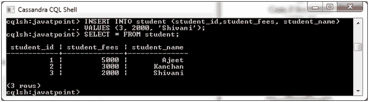
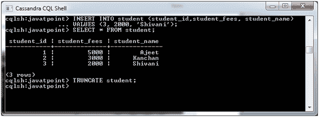
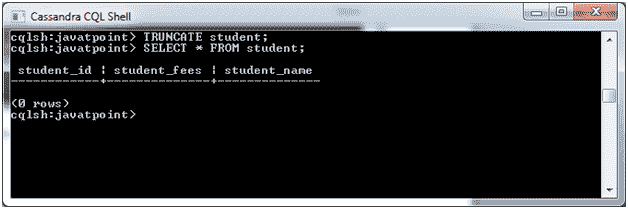

# 卡珊德拉截断表

> 原文：<https://www.javatpoint.com/cassandra-truncate-table>

TRUNCATE 命令用于截断表。如果截断一个表，该表的所有行都将被永久删除。

**语法:**

```

TRUNCATE <tablename> 

```

**示例:**

我们有一个名为“学生”的表，其中包含以下数据:



现在，我们使用 TRUNCATE 命令:

```

TRUNCATE student; 

```



现在，表被截断了。您可以使用 SELECT 命令进行验证。

```

SELECT * FROM student;

```



您可以看到该表现在被截断了。

* * *