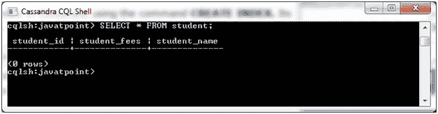
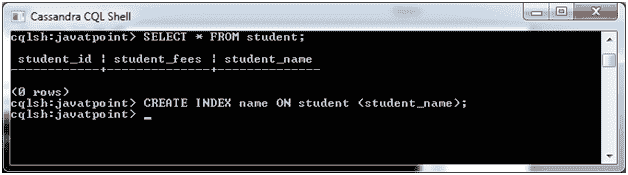

# Cassandra 创建索引

> 原文：<https://www.javatpoint.com/cassandra-create-index>

CREATE INDEX 命令用于在用户指定的列上创建索引。如果您选择索引的列的数据已经存在，Cassandra 会在“创建索引”语句执行期间对数据创建索引。

**语法:**

```sql

CREATE INDEX <identifier> ON <tablename> 

```

* * *

## 创建索引的规则

*   无法在主键上创建索引，因为主键已经被索引。
*   在 Cassandra 中，不支持集合索引。
*   如果不对该列进行索引，Cassandra 就无法筛选该列，除非它是主键。

**示例:**

让我们举个例子来演示如何在列上创建索引。在这里，我们为表“student”中的列“student_name”创建一个索引。

**前表:**



```sql

CREATE INDEX name ON student (student_name); 

```



索引是在“学生姓名”列上创建的。

#### 注意:您可以通过再次使用创建索引查询来验证索引是否已创建。它将显示一条消息，表明已经创建了索引。

* * *