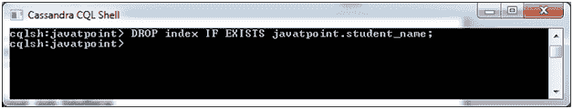
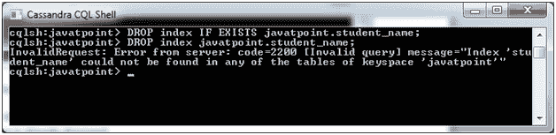

# 卡珊德拉下降指数

> 原文：<https://www.javatpoint.com/cassandra-drop-index>

DROP INDEX 命令用于删除指定的索引。如果在创建索引时没有指定索引名，则索引名为 TableName_ColumnName_idx。

**语法:**

```

DROP INDEX <identifier>

```

或者

```

Drop index IF EXISTS KeyspaceName.IndexName 

```

* * *

## 删除索引的规则

*   如果索引不存在，它将返回一个错误，除非您使用不返回任何操作的 IF EXISTS。
*   在索引创建过程中，必须用索引名指定键空间名，否则索引将从当前键空间中删除。

**示例:**

让我们举个例子来演示如何删除列上的索引。在这里，我们将创建的索引放到表“student”中的“student_name”列。键空间的名称是“javatpoint”。

```

Drop index IF EXISTS javatpoint.student_name 

```



索引从“学生名称”列中删除。

#### 注意:您可以通过再次使用 DROP index 命令来验证索引是否被删除。它将显示一条消息，表明索引已被删除。



你可以看到索引已经不在桌子上了。

* * *