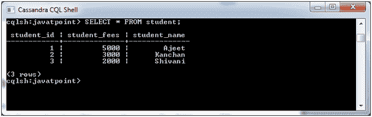
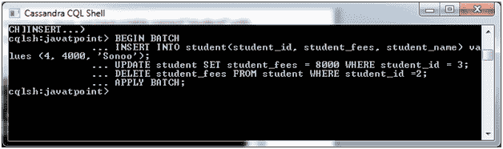
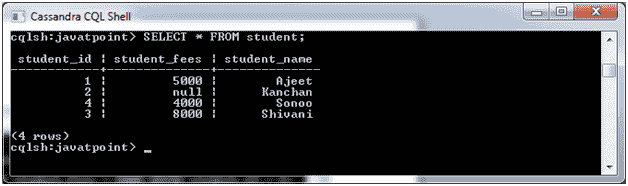

# Cassandra 批次

> 原文：<https://www.javatpoint.com/cassandra-batch>

在 Cassandra 中，BATCH 用于同时执行多个修改语句(插入、更新、删除)。当您必须更新一些列以及删除一些现有列时，这非常有用。

**语法:**

```sql

BEGIN BATCH
<insert-stmt>/ <update-stmt>/ <delete-stmt>
APPLY BATCH 

```

**示例:**

让我们举一个例子来演示 BATCH 命令。在这里，我们有一个名为“student”的表，它有列(student_id，student_fees student_name，)，有以下数据。



在本例中，我们将执行批处理(插入、更新和删除)操作:

*   插入一个包含以下详细信息的新行(4，4000，Sonoo)。
*   将 id 为 3 行的学生的学生费更新为 8000。
*   删除 id 为 2 的员工的学生费用。



现在应用批处理。您可以使用 SELECT 命令进行验证。



在这里，您可以看到该表完全被上述命令修改了。

* * *