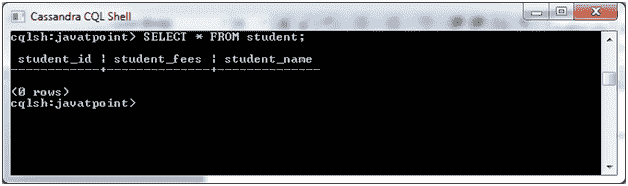
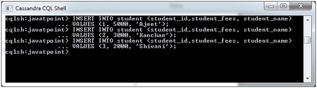
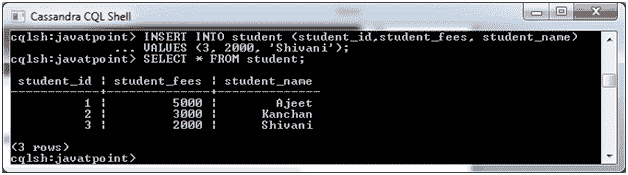

# Cassandra 创建数据

> 原文：<https://www.javatpoint.com/cql-create-data>

INSERT 命令用于将数据插入到表的列中。

**语法:**

```
INSERT INTO <tablename>
(<column1 name>, <column2 name>....)
VALUES (<value1>, <value2>....)
USING <option> 

```

**示例:**

我们有一个名为“student”的表，它有列(student_id，student_fees student_name)，需要在 student 表中插入一些数据。



| 学生 id | 学生费用 | 学生名称 |
| one | Five thousand | 阿杰 |
| Two | Three thousand | 研制的坎钱 |
| three | Two thousand | 史瓦妮 |

让我们看看在学生表中插入数据的代码。

```
INSERT INTO student (student_id, student_fees, student_name) 
VALUES(1,5000, 'Ajeet');
INSERT INTO student (student_id, student_fees, student_name) 
VALUES(2,3000, 'Kanchan');
INSERT INTO student (student_id, student_fees, student_name) 
VALUES(3, 2000, 'Shivani');

```



现在数据被插入。您可以使用 SELECT 命令来验证是否插入了数据。

```
SELECT * FROM student; 

```

输出:



* * *