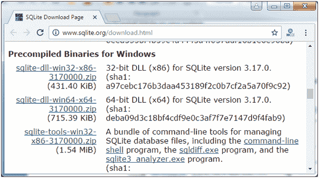
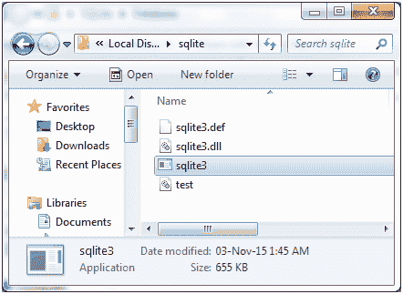
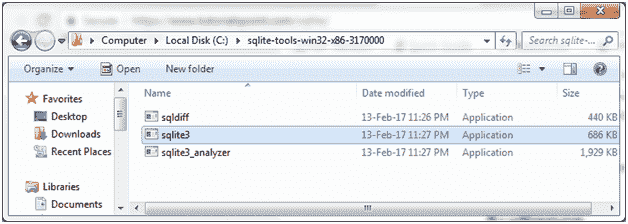
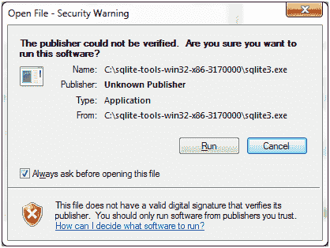
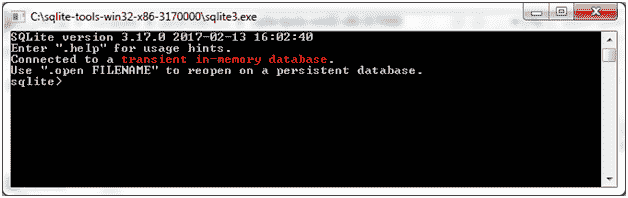

# SQLite 安装

> 原文：<https://www.javatpoint.com/sqlite-installation>

SQLite 以零配置而闻名，这意味着不需要复杂的设置或管理。让我们看看如何在您的系统上安装 SQLite。

* * *

## 在 Windows 上安装 SQLite

遵循以下步骤:

*   前往 SQLite 官网下载页面 http://www.sqlite.org/download.html 并从 Windows 部分下载预编译的二进制文件。

*   下载 sqlite-dll 和 sqlite-shell zip 文件。或者 SQLite-tools-win32-x86-3170000 . zip 文件。
*   在 C 目录中创建一个名为 sqlite 的文件夹，并展开这些文件。

*   打开命令提示符设置路径。设置您的 PATH 环境变量并打开 sqlite3 命令。它看起来像这样:

上述方法为您创建数据库、附加数据库和分离数据库提供了一种永久的方法。

在 SQLite 中执行 CRUD 操作还有另外一种方法。在这种方法中，不需要设置路径。

*   只需下载 SQlite 预编译的 Binary zip 文件。
*   展开压缩文件，您将看到如下页面:

*   运行选定的 sqlite3 应用程序:

 

您可以在这里执行 SQLite 查询。但是在这里，数据是暂时的，一旦你关闭计算机，你将丢失你所拥有的记录。因为，您不能在此创建、附加或分离数据库。

* * *