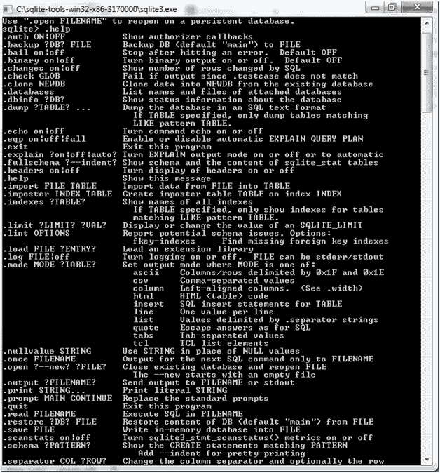
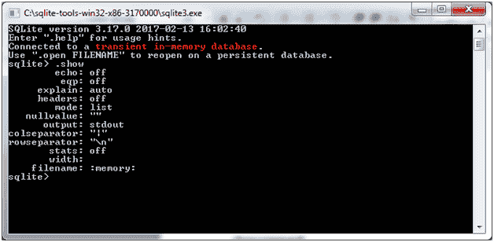

# SQLite 命令

> 原文：<https://www.javatpoint.com/sqlite-commands>

SQLite 命令类似于 SQL 命令。有三种类型的 SQLite 命令:

*   **DDL:** 数据定义语言
*   **DML:** 数据操作语言
*   **DQL:** 数据查询语言

* * *

## 数据定义语言

该组中有三个命令:

**CREATE:** 此命令用于在数据库中创建表、表的视图或其他对象。

**ALTER:** 用于修改现有的数据库对象，如表。

**DROP:**DROP 命令用于删除整个表、表的视图或数据库中的其他对象。

## 数据操作语言

数据操作语言组中有三个命令:

**INSERT:** 该命令用于创建记录。

**更新:**用于修改记录。

**DELETE:** 用于删除记录。

## 数据查询语言

**SELECT:** 该命令用于从一个或多个表中检索某些记录。

## SQLite 点命令

以下是 SQLite 点命令的列表。这些命令不以分号(；).

**。帮助命令:**

使用“”检查点命令列表。“随时帮忙。

**例如:**

```sql

Sqlite> .help

```



以上是各种重要的 SQLite dot 命令的列表。请参见下表中描述的这些命令:

| 命令 | 描述 |
| 。后援？db？文件 | 将数据库(默认为“主”)备份到文件 |
| 。保释 | 遇到错误后停止。默认关闭 |
| 。数据库 | 列出附加数据库的名称和文件 |
| 。垃圾场？桌子？ | 以 sql 文本格式转储数据库。如果指定了 table，则仅转储与模式表匹配的表。 |
| 。回声开启&#124;关闭 | 打开或关闭命令回声 |
| 。出口 | 退出 sqlite 提示 |
| 。解释开&#124;关 | 打开或关闭适合解释输出模式。没有参数时，它会打开解释。 |
| 。页眉打开&#124;关闭 | 打开或关闭标题显示 |
| 。帮助 | 显示此消息 |
| 。导入文件表 | 将数据从文件导入表中 |
| 。指数？桌子？ | 显示所有索引的名称。如果指定了 table，则只显示与模式表匹配的表的索引。 |
| 。加载文件？入口？ | 加载扩展库 |
| 。日志文件&#124;关闭 | 打开或关闭登录。文件可以是 stderr/stdout |
| 。模式模式 | 设置输出模式，其中模式为以下之一:
csv:逗号分隔值

列:左对齐列。
html: html 代码
insert: sql insert 语句对于表
行:每行一个值
列表:值由。分隔符字符串
选项卡:制表符分隔的值
tcl: tcl 列表元素

 |
| 。nullvalue 字符串 | 打印字符串代替空值 |
| 。输出文件名 | 将输出发送到文件名 |
| 。输出标准输出 | 向屏幕发送输出 |
| 。打印字符串... | 打印文字字符串 |
| 。提示主继续 | 替换标准提示 |
| 。放弃 | 退出 sqlite 提示 |
| 。读取文件名 | 在文件名中执行 sql |
| 。模式？桌子？ | 显示 create 语句。如果指定了 table，则只显示像 pattern table 这样匹配的表。 |
| 。分隔符字符串 | 更改输出模式和使用的分隔符。进口 |
| 。显示 | 显示各种设置的当前值 |
| 。统计开启&#124;关闭 | 打开或关闭统计 |
| 。桌子？模式？ | 列出匹配相似模式的表的名称 |
| 。超时毫秒 | 尝试打开锁定的表，时间为毫秒 |
| . width num num | 设置“列”模式的列宽 |
| 。计时器开启&#124;关闭 | 打开或关闭 cpu 计时器测量 |

**。显示命令:**

您可以使用。显示命令，查看 SQLite 命令提示符的默认设置。



#### 注意:不要在 sqlite >提示符和点命令之间加空格，否则不起作用。

* * *

## 特殊点命令

有一些用于格式化输出的点命令。这些命令是:

。打开标题

。模式列

。定时器开启

* * *