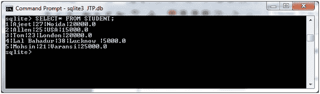
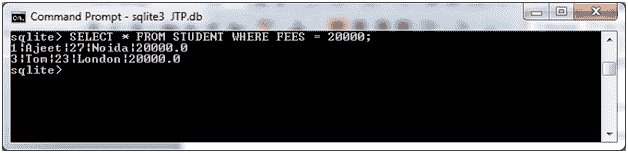
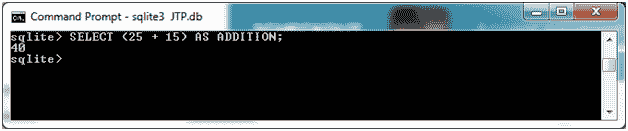
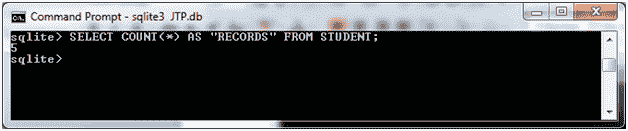
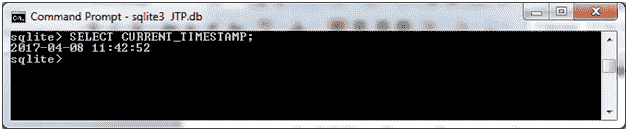

# SQLite 表达式

> 原文：<https://www.javatpoint.com/sqlite-expressions>

SQLite 表达式是一个或多个值、运算符和 SQL 函数的组合。这些表达式用于计算值。

SQLite 表达式用查询语言编写，并与 SELECT 语句一起使用。

**语法:**

```sql

SELECT column1, column2, columnN 
FROM table_name 
WHERE [CONDITION | EXPRESSION]; 

```

SQLite 表达式主要有三种类型:

* * *

### 1) SQLite 布尔表达式

SQLite 布尔表达式用于在匹配单个值的基础上获取数据。

**语法:**

```sql

SELECT column1, column2, columnN 
FROM table_name 
WHERE SINGLE VALUE MATCHTING EXPRESSION; 

```

**示例:**

我们有一个名为“STUDENT”的现有表，包含以下数据:



请看这个简单的 SQLite 布尔表达式的例子。

```sql

SELECT * FROM STUDENT WHERE FEES = 20000; 

```

输出:



* * *

### 2) SQLite 数值表达式

SQLite 数值表达式用于执行查询中的任何数学运算。

**语法:**

```sql

SELECT numerical_expression as  OPERATION_NAME
[FROM table_name WHERE CONDITION] ; 

```

**示例 1:**

**选择(25 + 15)作为加法；**

输出:



数值表达式包含几个内置函数，如 avg()、sum()、count()等。这些函数被称为聚合数据计算函数。

**从学生中选择计数(*)作为“记录”；**

输出:



* * *

### 3) SQlite 日期表达式

SQlite 日期表达式用于获取当前系统日期和时间值。

**语法:**

```sql

SELECT CURRENT_TIMESTAMP; 

```

选择当前时间戳；

输出:



* * *