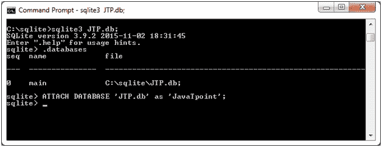
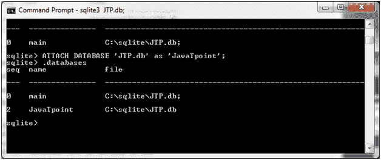

# SQLite 附加数据库

> 原文：<https://www.javatpoint.com/sqlite-attach-database>

### 什么是附加数据库？

假设有多个数据库可用，并且一次只能使用其中一个。这就是为什么使用 ATTACH DATABASE 语句。它便于您选择特定的数据库，并且在使用此命令后，所有的 SQLite 语句都将在附加的数据库下执行。

**语法:**

```

ATTACH DATABASE 'DatabaseName' As 'Alias-Name'; 

```

#### 注意:如果数据库不存在，上面的语法也将创建一个数据库，否则它将只附加一个带有逻辑数据库别名的数据库文件名。

举个例子吧。我们有一个现有的数据库 JTP.db。

**示例:**

```

ATTACH DATABASE 'JTP.db' as 'JavaTpoint'; 

```



数据库已附加，现在您可以使用。数据库命令:



* * *