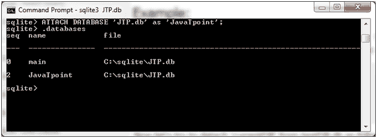
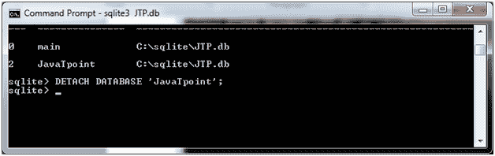
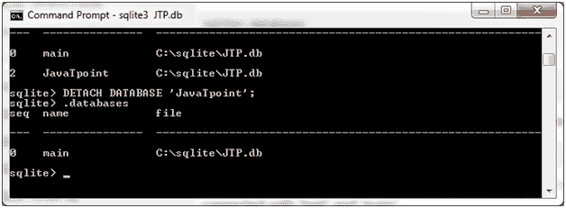

# SQLite 分离数据库

> 原文：<https://www.javatpoint.com/sqlite-detach-database>

SQLite DETACH DATABASE 语句用于从以前使用 ATTACH 语句连接的数据库连接中分离别名数据库。

如果同一个数据库文件附加了多个别名，那么 DETACH 命令将只断开给定的名称，而附件的其余部分仍将继续。无法分离主数据库和临时数据库。

#### 注意:内存或临时数据库中的数据库将被完全销毁，内容将丢失。

**语法:**

```

DETACH DATABASE 'Alias-Name'

```

让我们举一个例子来演示如何分离一个附加的别名数据库。这里，我们有一个附加的数据库“JavaTpoint”。



**从 JTP.db 中分离“JavatPoint”:**

```

DETACH DATABASE 'JavaTpoint'; 

```



数据库现在已分离。你可以用”来看。数据库”命令。



* * *