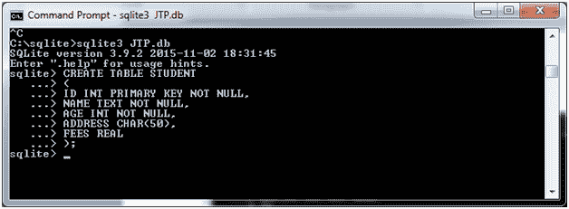
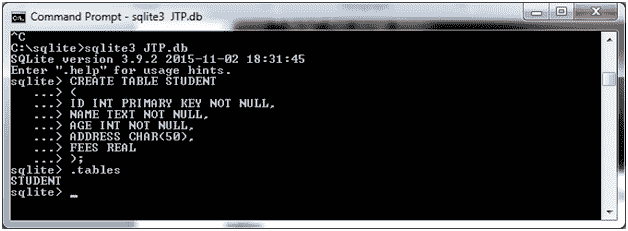
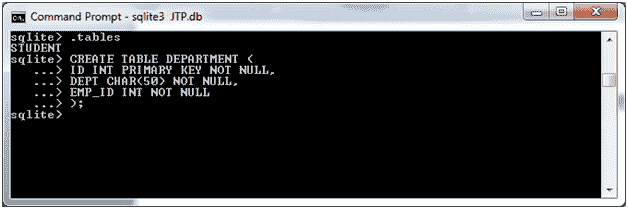
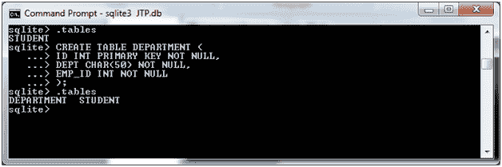

# SQLite 创建表

> 原文：<https://www.javatpoint.com/sqlite-create-table>

在 SQLite 中，CREATE TABLE 语句用于创建新表。创建表时，我们命名该表，并定义其列和每列的数据类型。

**语法:**

```

CREATE TABLE database_name.table_name(
   column1 datatype  PRIMARY KEY(one or more columns),
   column2 datatype,
   column3 datatype,
   .....
   columnN datatype,
);

```

让我们举一个在 SQLite 数据库中创建表的例子:

```

CREATE TABLE STUDENT(
   ID INT PRIMARY KEY     NOT NULL,
   NAME           TEXT    NOT NULL,
   AGE            INT     NOT NULL,
   ADDRESS        CHAR(50),
   FEES         REAL
); 

```



使用 SQLite”。命令查看您的表是否已成功创建。

**。表格**



让我们为将来的操作创建另一个表 DEPERTMENT。

```

CREATE TABLE DEPARTMENT(
 ID INT PRIMARY KEY      NOT NULL,
  DEPT           CHAR(50) NOT NULL,
  EMP_ID         INT      NOT NULL
); 

```

现在，我们有两张桌子“部门”和“学生”。



现在检查创建的表:



* * *