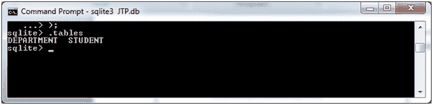
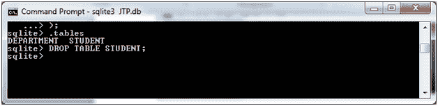
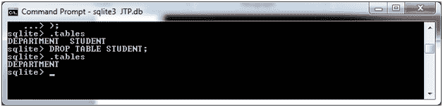

# SQLite 拖放表

> 原文：<https://www.javatpoint.com/sqlite-drop-table>

在 SQLite 中，DROP TABLE 语句用于删除表定义以及与该表相关联的所有相关数据、索引、触发器、约束和权限规范。

**语法:**

```sql

DROP TABLE database_name.table_name; 

```

#### 注意:使用 DROP TABLE 命令时必须非常小心，因为一旦删除了表，手机中所有可用的信息都会被破坏，并且您无法恢复。

让我们举个例子来演示如何在 SQLite 中删除一个表。

我们已经有两张桌子“部门”和“学生”。我们可以用。tables 命令。



所以你可以看到我们有两张桌子。

让我们删除“学生”表。

```sql

DROP TABLE STUDENT;

```



您可以使用来验证它。tables 命令。



您可以看到数据库中只有一个表。这意味着另一个表被丢弃。

* * *