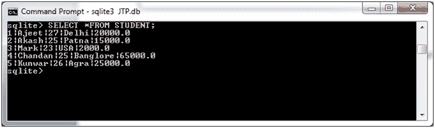
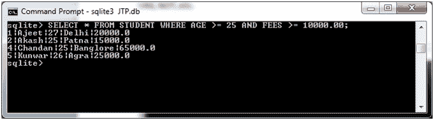
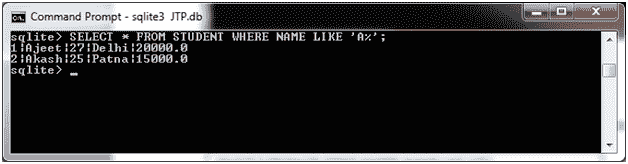
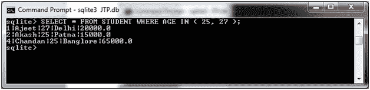
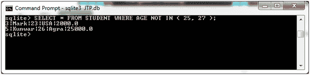

# SQLite WHERE 子句

> 原文：<https://www.javatpoint.com/sqlite-where-clause>

SQLite WHERE 子句通常与 SELECT、UPDATE 和 DELETE 语句一起使用，以便在从一个或多个表中获取数据时指定一个条件。

如果条件满足或为真，它将从表中返回特定值。您可以使用 WHERE 子句来筛选记录，并且只获取必要的记录。

WHERE 子句也用于过滤记录并只获取特定的数据。

**语法:**

```sql

SELECT column1, column2, columnN 
FROM table_name
WHERE [condition]

```

**示例:**

在本例中，我们将 WHERE 子句与几个比较运算符和逻辑运算符一起使用。like >、

我们有一个学生表格，有以下数据:



**示例 1:**

选择年龄大于或等于 25 岁且费用大于或等于 10000.00 的学生

```sql

SELECT * FROM STUDENT WHERE AGE >= 25 AND FEES >= 10000.00; 

```

输出:



**示例 2:**

从学生表格中选择学生，姓名以“A”开头，与“A”后面的内容无关。

```sql

SELECT * FROM STUDENT WHERE NAME LIKE 'A%';

```

输出:



**示例 3:**

从学生表中选择年龄为 25 或 27 岁的所有学生。

```sql

SELECT * FROM STUDENT WHERE AGE IN ( 25, 27 );

```

输出:



**示例 4:**

从学生表中选择年龄既不在 25 岁也不在 27 岁的所有学生。

输出:



* * *