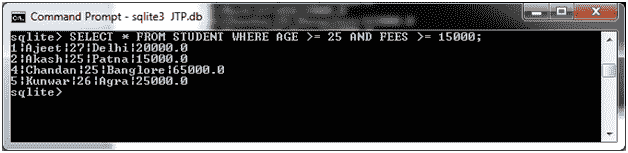

# SQLite 和运算符

> 原文：<https://www.javatpoint.com/sqlite-and-clause>

SQLite AND 运算符通常与 SELECT、UPDATE 和 DELETE 语句一起使用来组合多个条件。它是一个连接运算符，在同一个 SQLite 语句中与不同的运算符进行多次比较。

它总是与 WHERE 子句一起使用。

**语法:**

```

SELECT column1, column2, columnN 
FROM table_name
WHERE [condition1] AND [condition2]...AND [conditionN]; 

```

**示例:**

我们有一个名为“STUDENT”的表，其中包含以下数据:


从“学生”表中选择年龄大于或等于 25 岁且费用大于或等于 20000.00 的所有学生

```

SELECT * FROM STUDENT WHERE AGE >= 25 AND FEES >= 15000; 

```

输出:



* * *