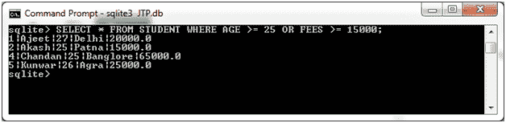

# SQLite 或运算符

> 原文：<https://www.javatpoint.com/sqlite-or-clause>

SQLite OR 运算符通常与 SELECT、UPDATE 和 DELETE 语句一起用于组合多个条件。OR 运算符总是与 WHERE 子句一起使用，如果两个条件中的任何一个都为真，则完整条件被假定为真。

**语法:**

```

SELECT column1, column2, columnN 
FROM table_name
WHERE [condition1] OR [condition2]...OR [conditionN]

```

您可以使用或运算符组合多个条件。

**示例:**

我们有一个名为“STUDENT”的表，其中包含以下数据:


从“学生”表中选择年龄大于或等于 25 岁或费用大于或等于 15000.00 的所有学生

```

SELECT * FROM STUDENT WHERE AGE >= 25 OR FEES >= 15000; 

```

输出:



* * *