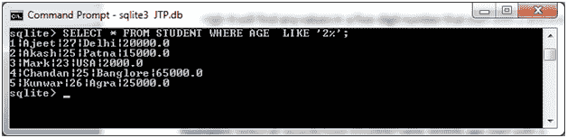

# 相似子句(运算符)

> 原文：<https://www.javatpoint.com/sqlite-like-clause>

SQLite LIKE 运算符用于使用通配符将文本值与模式进行匹配。如果搜索表达式与模式表达式匹配，LIKE 运算符将返回 true，即 1。

有两个通配符与 LIKE 运算符结合使用:

*   百分比符号(%)
*   下划线(_)

百分号代表零、一或多个数字或字符。下划线代表单个数字或字符。

**语法:**

```

SELECT FROM table_name
WHERE column LIKE 'XXXX%'

```

**或**

```

SELECT FROM table_name
WHERE column LIKE '%XXXX%'

```

**或**

```

SELECT FROM table_name
WHERE column LIKE 'XXXX_'

```

**或**

```

SELECT FROM table_name
WHERE column LIKE '_XXXX'

```

**或**

```

SELECT FROM table_name
WHERE column LIKE '_XXXX_'

```

这里，XXXX 可以是任何数值或字符串值。

**示例:**

我们有一个名为“STUDENT”的表，其中包含以下数据:


在这些示例中，WHERE 语句具有不同的 LIKE 子句，带有“%”和“_”运算符，并且操作是在“FEES”上完成的:

| 声明 | 描述 |
| 其中 FEES 表示“200%” | 它会找到任何以 200 开头的值。 |
| 其中 FEES 如“%200%” | 它会找到任何位置有 200 的值。 |
| 其中 FEES 如“_00%” | 它会在第二个和第三个位置找到任何有 00 的值。 |
| 其中 FEES 如“2_%_%” | 它会找到任何以 2 开头且长度至少为 3 个字符的值。 |
| 其中像“%2”这样的 FEES | 它会找到任何以 2 结尾的值 |
| 其中 FEES 如' _2%3 ' | 它将在第二个位置找到任何以 2 结尾的值 |
| 其中费用如“2 _ _ _ _3” | 它会找到以 2 开头、以 3 结尾的五位数中的任何值 |

**示例 1:** 从学生表中选择年龄以 2 开头的所有记录。

```

SELECT * FROM STUDENT WHERE AGE  LIKE '2%'; 

```

输出:



**示例 2:**

从“学生”表中选择所有记录，其中“地址”文本中有“a”:

```

SELECT * FROM STUDENT WHERE ADDRESS LIKE '%a%'; 

```

输出:


* * *