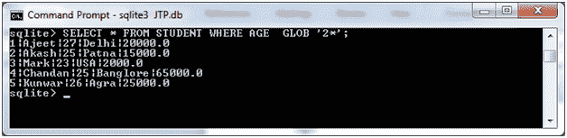
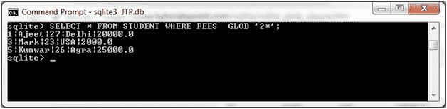

# SQLite GLOB 子句(运算符)

> 原文：<https://www.javatpoint.com/sqlite-glob-clause>

SQLite GLOB 运算符通过使用通配符，只将文本值与模式进行匹配。当搜索表达式与模式表达式匹配时，GLOB 运算符将返回 true，即 1。

GLOB 运算符遵循 UNIX 的语法来指定下列通配符。

*   **星号(*):** 该符号表示零个或多个数字或字符
*   **问号(？):**此符号代表一个数字或字符。

**语法:**

**星号的语法:**

```sql

SELECT FROM table_name
WHERE column GLOB 'XXXX*'
or 
SELECT FROM table_name
WHERE column GLOB '*XXXX*' 

```

**问号语法:**

```sql

SELECT FROM table_name
WHERE column GLOB 'XXXX?'
or
SELECT FROM table_name
WHERE column GLOB '?XXXX'
or
SELECT FROM table_name
WHERE column GLOB '?XXXX?'
or
SELECT FROM table_name
WHERE column GLOB '????' 

```

**示例:**

我们有一个名为“STUDENT”的表，其中包含以下数据:


在这些示例中，WHERE 语句具有不同的带有“*”和“？”的 BLOB 子句操作员:

| 声明 | 描述 |
| 费用全球' 200* ' | 查找任何以 200 开头的值 |
| 地方费用全球' *200* ' | 查找任何位置有 200 的值 |
| 费用在哪里？00*' | 查找第二个和第三个位置为 00 的任何值 |
| 全球费用在哪里？?' | 查找任何以 2 开头且长度至少为 3 个字符的值 |
| 地方费用全球' *2 ' | 查找以 2 结尾的任何值 |
| 费用在哪里？2*3' | 查找第二个位置为 2 且以 3 结尾的任何值 |
| 全球费用在哪里？？？3' | 查找以 2 开头、以 3 结尾的五位数中的任何值 |

**示例 1:**

从“学生”表中选择年龄以 2 开头的所有记录:

```sql

SELECT * FROM STUDENT WHERE AGE  GLOB '2*'; 

```

输出:



**示例 2:**

从表“学生”中选择所有记录，其中 FEES 以 2 开头:

```sql

SELECT * FROM STUDENT WHERE FEES  GLOB '2*'; 

```

输出:



* * *