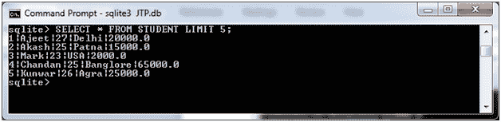
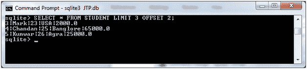

# SQLite 限制子句

> 原文：<https://www.javatpoint.com/sqlite-limit-clause>

SQLite LIMIT 子句用于限制 SELECT 命令从表中提取的数据量。

**语法:**

```sql

SELECT column1, column2, columnN 
FROM table_name
LIMIT [no of rows] 

```

LIMIT 子句也可以与 OFFSET 子句一起使用。

```sql

SELECT column1, column2, columnN 
FROM table_name
LIMIT [no of rows] OFFSET [row num] 

```

**示例:**

让我们举个例子来演示 SQLite LIMIT 子句。我们有一个名为“STUDENT”的表，其中包含以下数据:


**示例 1:**

根据需要的行数，使用 LIMIT 从“STUDENT”表中获取记录。

```sql

SELECT * FROM STUDENT LIMIT 5; 

```

输出:



**示例 2:**

偏移用于不从表中检索偏移记录。它用于我们必须从某个点开始检索记录的某些情况:

从 3 <sup>第 3</sup>位置开始，从表格“STUDENT”中选择 3 条记录。

```sql

SELECT * FROM STUDENT LIMIT 3 OFFSET 2; 

```

输出:



* * *