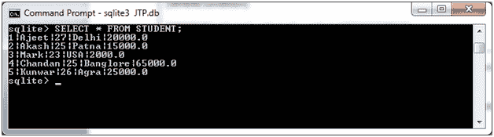
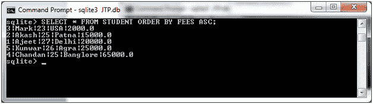
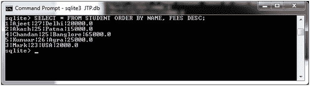

# SQLite 订单依据子句

> 原文：<https://www.javatpoint.com/sqlite-order-by-clause>

SQLite ORDER BY 子句用于根据一列或多列，按升序或降序对提取的数据进行排序。

**语法:**

```sql

SELECT column-list 
FROM table_name 
[WHERE condition] 
[ORDER BY column1, column2, .. columnN] [ASC | DESC]; 

```

您可以在 ORDER BY 子句中使用一列或多列。您使用的列必须显示在列列表中。

让我们举个例子来演示 ORDER BY 子句。我们有一个名为“STUDENT”的表，其中包含以下数据:



**示例 1:**

从“学生”中选择所有记录，其中费用按升序排列:

```sql

SELECT * FROM STUDENT ORDER BY FEES ASC; 

```

输出:



**示例 2:**

从“学生”表中获取所有数据，并按姓名和费用降序对结果进行排序:

```sql

SELECT * FROM STUDENT ORDER BY NAME, FEES DESC; 

```

输出:



* * *