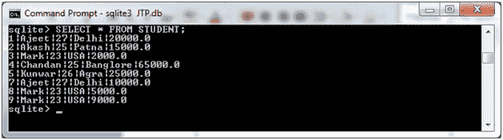
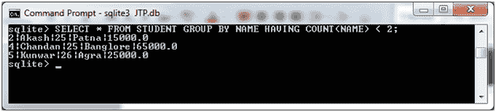
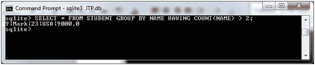

# SQLite HAVING 子句

> 原文：<https://www.javatpoint.com/sqlite-having-clause>

SQLite HAVING 子句用于指定过滤哪些组结果出现在最终结果中的条件。WHERE 子句在选定的列上设置条件，而 HAVING 子句在 GROUP BY 子句创建的组上设置条件。

HAVING 子句在选择查询中的位置:

```sql

SELECT
FROM
WHERE
GROUP BY
HAVING
ORDER BY

```

**语法:**

```sql

SELECT column1, column2
FROM table1, table2
WHERE [ conditions ]
GROUP BY column1, column2
HAVING [ conditions ]
ORDER BY column1, column2

```

**示例:**

让我们举个例子来说明 HAVING 子句。我们有一个名为“STUDENT”的表，它包含以下数据:



**示例 1:**

显示名称计数小于 2 的所有记录:

```sql

SELECT * FROM STUDENT GROUP BY NAME HAVING COUNT(NAME) < 2; 

```

输出:



**示例 2:**

显示名称计数大于 2 的所有记录:

```sql

SELECT * FROM STUDENT GROUP BY NAME HAVING COUNT(NAME) > 2;

```

输出:



* * *