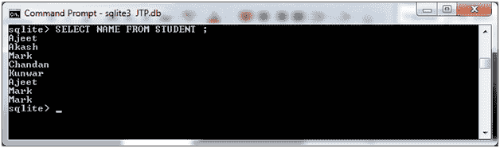
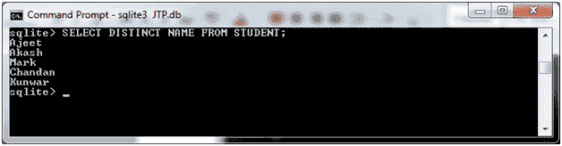

# SQLite DISTINCT 子句

> 原文：<https://www.javatpoint.com/sqlite-distinct-keyword>

SQLite DISTINCT 子句与 SELECT 语句一起使用，以消除所有重复的记录，并且只获取唯一的记录。

当表中有多条重复记录时使用。

**语法:**

```

SELECT DISTINCT column1, column2,.....columnN 
FROM table_name
WHERE [condition] 

```

**示例:**

我们有一个名为“STUDENT”的表，它包含以下数据:


首先从“学生”中选择姓名，不要使用 DISTINCT 关键字。它将显示重复的记录:

```

SELECT NAME FROM STUDENT ;

```

输出:



现在，使用 DISTINCT 关键字从“学生”中选择名称。

```

SELECT DISTINCT NAME FROM STUDENT;

```

输出:



* * *