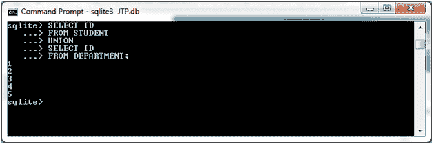
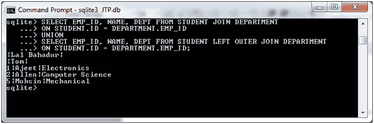

# SQLite 联合运算符

> 原文：<https://www.javatpoint.com/sqlite-union>

SQLite UNION 运算符用于使用 SELECT 语句组合两个或多个表的结果集。UNION 运算符仅显示唯一的行，并删除重复的行。

使用 UNION 运算符时，每个 SELECT 语句在结果集中必须有相同数量的字段。

**语法:**

```

SELECT expression1, expression2, ... expression_n
FROM tables
[WHERE conditions]
UNION
SELECT expression1, expression2, ... expression_n
FROM tables
[WHERE conditions]; 

```

**示例:**

我们有两张桌子“学生”和“部门”。


“学生”表包含以下数据:


“部门”表包含以下数据:


**示例 1:返回单个字段**

这个简单的示例只从多个 SELECT 语句中返回一个字段，其中两个字段具有相同的数据类型。

让我们取上面两个表“STUDENT”和“DEPARTMENT”，从这两个表中选择 id，进行 **UNION。**

```

SELECT ID FROM STUDENT
UNION
SELECT ID FROM DEPARTMENT; 

```

输出:



**示例 2:内外连接的联合**

让我们以上面的两个表“学生”和“部门”为例，根据下面的条件和 UNION 子句进行内部连接和外部连接:

```

SELECT EMP_ID, NAME, DEPT FROM STUDENT JOIN DEPARTMENT
ON STUDENT.ID = DEPARTMENT.EMP_ID
UNION
SELECT EMP_ID, NAME, DEPT FROM STUDENT LEFT OUTER JOIN DEPARTMENT
ON STUDENT.ID = DEPARTMENT.EMP_ID; 

```

输出:



* * *