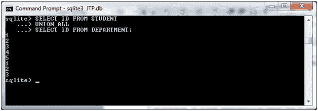
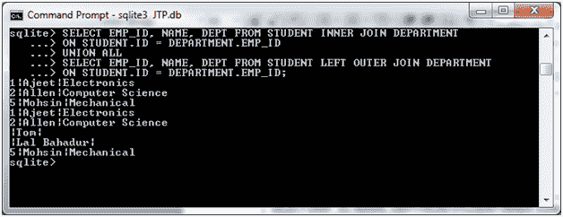

# SQLite 联合所有运算符

> 原文：<https://www.javatpoint.com/sqlite-union-all>

SQLite UNION ALL 运算符用于组合两个或多个 SELECT 语句的结果，而不忽略重复的行。

在 SQLite UNION ALL 中，结果表也包括重复的值。否则，相同的规则适用于工会。

**语法:**

```

SELECT expression1, expression2, ... expression_n
FROM tables
[WHERE conditions]
UNION ALL
SELECT expression1, expression2, ... expression_n
FROM tables
[WHERE conditions];

```

**示例:**

我们有两张桌子“学生”和“部门”。


“学生”表包含以下数据:


“部门”表包含以下数据:


**示例 1:返回单个字段**

这个简单的示例只从多个 SELECT 语句中返回一个字段，其中两个字段具有相同的数据类型。

让我们取上面两个表“STUDENT”和“DEPARTMENT”，从两个表中选择 id，使 **UNION ALL。**

```

SELECT ID FROM STUDENT
UNION ALL 
SELECT ID FROM DEPARTMENT; 

```

输出:



**示例 2:内外连接的联合**

让我们以上面的两个表“学生”和“部门”为例，根据下面的条件和 **UNION ALL** 子句进行内部连接和外部连接:

```

SELECT EMP_ID, NAME, DEPT FROM STUDENT INNER JOIN DEPARTMENT
ON STUDENT.ID = DEPARTMENT.EMP_ID
UNION ALL
SELECT EMP_ID, NAME, DEPT FROM STUDENT LEFT OUTER JOIN DEPARTMENT
ON STUDENT.ID = DEPARTMENT.EMP_ID; 

```

输出:



* * *