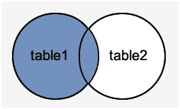
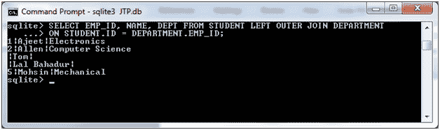

# SQLite 外部连接

> 原文：<https://www.javatpoint.com/sqlite-outer-join>

在 SQL 标准中，有三种类型的外部联接:

*   左外连接
*   右外连接
*   完全外部连接。

但是，SQLite 只支持左外连接。

* * *

## SQlite 左外连接

SQLite 左外连接用于从开条件中指定的左表中获取所有行，并且只获取右表中满足连接条件的那些行。

**语法:**

```

SELECT ... FROM table1 LEFT OUTER JOIN table2 ON conditional_expression 

```

或者

```

SELECT ... FROM table1 LEFT OUTER JOIN table2 USING ( column1 ,......

```

**图像表示:**



我们有两张桌子“学生”和“部门”。


“学生”表包含以下数据:


“部门”表包含以下数据:


让我们取上面的两个表“STUDENT”和“DEPARTMENT”，根据下面的条件进行内部连接:

**示例:**

```

SELECT EMP_ID, NAME, DEPT FROM STUDENT LEFT OUTER JOIN DEPARTMENT
ON STUDENT.ID = DEPARTMENT.EMP_ID;

```



* * *