# SQLite Julianday 函数

> 原文：<https://www.javatpoint.com/sqlite-juliandday>

SQLite julianday 函数便于您应用修饰符，然后在将日期作为输入后，将日期作为儒略日返回。

儒略日是自公元前 4714 年 11 月 24 日公历格林威治时间下午 12:00 以来的天数。julianday 函数以浮点数的形式返回日期。

**语法:**

```

julianday(timestring [, modifier1, modifier2, ... modifier_n ] ) 

```

**示例 1:检索当前日期:**

```

SELECT julianday('2017-04-13');
SELECT julianday('2017-04-13 16:45');
SELECT julianday('2017-04-13 16:45:30');
SELECT julianday('now'); 

```

输出:

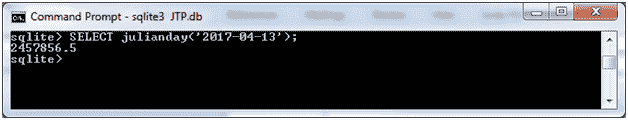 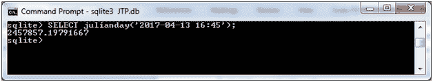 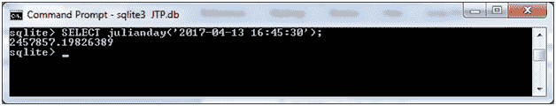 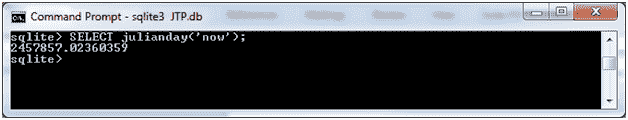

**示例 2:检索每月的第一天:**

```

SELECT julianday('2017-04-13', 'start of month');
SELECT julianday('now', 'start of month');
SELECT julianday('2017-03-13', '-6 days');
SELECT julianday('now', '-6 days');

```

输出:

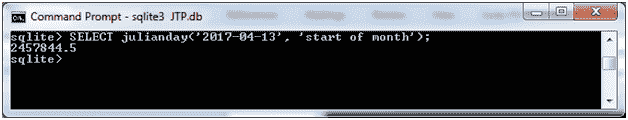 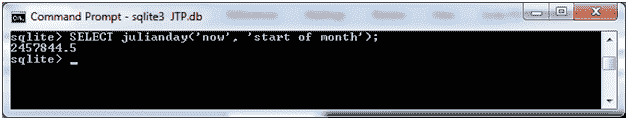 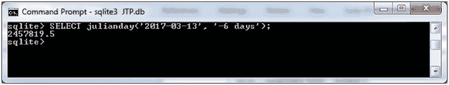 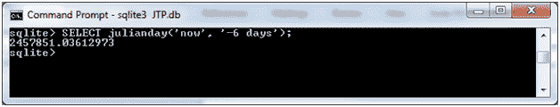

**示例 2:检索一个月的最后一天:**

```

SELECT julianday('2017-03-07', 'start of month', '+1 month', '-1 day');
SELECT julianday('now', 'start of month', '+1 month', '-1 day');
SELECT julianday('2017-03-07', '+24 days');
SELECT julianday('now', '+24 days');

```

输出:

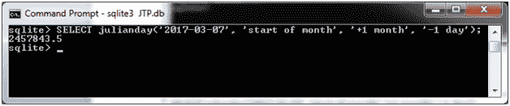 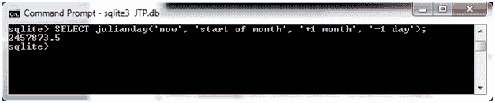 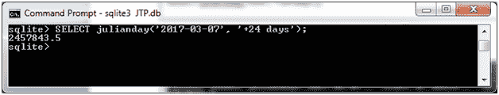 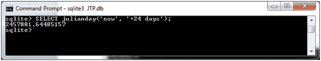

**例 3:当前日期加减年/日:**

```

SELECT julianday('2017-04-14', '+2 years');
SELECT julianday('now', '+5 years');
SELECT julianday('now', '-7 days'); 

```

输出:

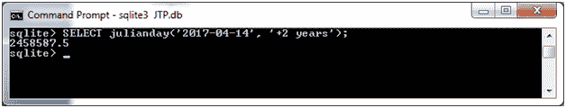 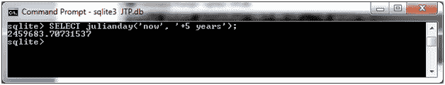 

* * *