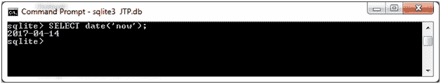
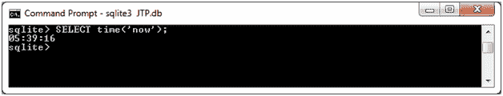
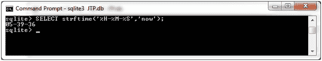
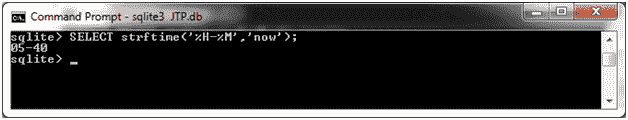

# SQLite 立即功能

> 原文：<https://www.javatpoint.com/sqlite-now>

SQLite“now”实际上不是一个函数，但是“now”是一个 timestring 参数，在各种 SQLite 函数中用来获取当前的日期和时间。

**语法:**

SQLite 中的 now 函数有三种语法:

```

date('now') 

```

或者

```

time('now')

```

或者

```

strftime(format, 'now')
i.e. 
strftime('%Y-%m-%d','now')
strftime('%Y-%m-%d %H-%M','now')
strftime('%Y-%m-%d %H-%M-%S','now')

```

当使用 strftime 函数表示当前日期/时间时，使用第三种语法。这里的“格式”可以是以下任何一种:

| 索引 | 格式 | 说明 |
| 1) | %Y | 4 位数的年份(0000 到 9999) |
| 2) | %W | 一年中的一周(00 到 53) |
| 3) | %w | 一周中的某一天(0 到 6，其中 0 是星期日) |
| 4) | %m | 一年中的月份(01 至 12) |
| 5) | %d | 一个月中的某一天(00 到 31) |
| 6) | %H | 小时(00 到 24) |
| 7) | %M | 分钟(00 到 25) |
| 8) | %S | 秒(00 到 59) |
| 9) | %s | 1970-01-01 以来的秒数 |
| 10) | %f | 分数秒。SSS) |
| 11) | %j | 一年中的某一天(001 到 366) |
| 12) | %J | 儒略日作为数值 |

**示例:检索当前日期:**

```

SELECT date('now');
SELECT strftime('%Y-%m-%d','now');

```

输出:

 

**示例:检索当前时间:**

```

SELECT time('now');  (HH-MM-SS Format)
SELECT strftime('%H-%M-%S','now');   (HH-MM-SS Format) 
SELECT strftime('%H-%M-%f','now');  (HH-MM-SS.SSS Format) 
SELECT strftime('%H-%M','now');  (HH-MM Format)

```

输出:

   

* * *