# SQLite strftime Function

> 原文： [https://www.javatpoint.com/sqlite-strftime](https://www.javatpoint.com/sqlite-strftime)

SQLite strftime 函数是一个非常强大的函数，它方便您获取日期和时间，还可以执行日期计算。

**语法:**

```

strftime(format, timestring [, modifier1, modifier2, ... modifier_n ] ) 

```

这里，**格式**可以是以下任意一种:

| 索引 | 格式 | 说明 |
| 1) | %Y | 4 位数的年份(0000 到 9999) |
| 2) | %W | 一年中的一周(00 到 53) |
| 3) | %w | 一周中的某一天(0 到 6，其中 0 是星期日) |
| 4) | %m | 一年中的月份(01 至 12) |
| 5) | %d | 一个月中的某一天(00 到 31) |
| 6) | %H | 小时(00 到 24) |
| 7) | %M | 分钟(00 到 25) |
| 8) | %S | 秒(00 到 59) |
| 9) | %s | 1970-01-01 以来的秒数 |
| 10) | %f | 分数秒。SSS) |
| 11) | %j | 一年中的某一天(001 到 366) |
| 12) | %J | 儒略日作为数值 |

这里，**时间字符串**是一个日期值，可以是以下任何一个:

| 索引 | 时间字符串 | 描述 |
| 1) | 现在 | 它是用于返回当前日期的文字。 |
| 2) | 年-月-日 | 它指定格式为“年-月-日”的日期值 |
| 3) | 年-月-日 HH:MM | 它指定格式为“年-月-日 HH:MM”的日期值 |
| 4) | 年-月-日时:分:秒 | 它指定格式为“年-月-日 HH:MM:SS”的日期值 |
| 5) | 年-月-日 HH:MM:SS。选征兵役制（SelectiveServiceSystem） | 它指定格式为“年-月-日”的日期值。' SSS ' |
| 6) | HH:MM | 它指定格式为“时:分”的日期值 |
| 7) | 时:分:秒 | 它指定格式为“时:分:秒”的日期值 |
| 8) | HH:MM:SS。选征兵役制（SelectiveServiceSystem） | 它指定格式为“时:分:秒”的日期值。' SSS ' |
| 9) | 年-月-日-日：月 | 它指定格式为“YYYY-MM-DDTHH:MM”的日期值，其中 t 是分隔日期和时间部分的文字字符。 |
| 10) | 年-月-日：月：SS | 它指定格式为“YYYY-MM-DDTHH:MM:SS”的日期值，其中 t 是分隔日期和时间部分的文字字符 |
| 11) | YYYY-MM-DDTHH:MM:SS。选征兵役制（SelectiveServiceSystem） | 它指定格式为' YYYY-MM-DDTHH:MM:SS '的日期值。其中 t 是分隔日期和时间部分的文字字符 |
| 12) | 个性签名 | 它指定了儒略日号码 |

**modifier1，modifier2，...修改器 _n:** 修改器是可选的。这些与 timestring 一起使用，用于添加或减去时间、日期或年份。

| 索引 | 修饰语 | 描述 |
| 1) | [+-]NNN 年 | 它用于指定日期增加/减少的年数 |
| 2) | [+-]NNN 月 | 它用于指定日期增加/减少的月数 |
| 3) | [+-]NNN 的日子 | 它用于指定日期增加/减少的天数 |
| 4) | [+-]NNN 时间 | 它用于指定日期增加/减少的小时数 |
| 5) | [+-]NNN 分钟 | 它用于指定日期增加/减少的分钟数 |
| 6) | [+-]NNN 秒 | 它用于指定日期增加/减少的秒数 |
| 7) | [+-]NNN。NNNN 秒 | 它用于指定添加/减去日期的秒数(和分数秒) |
| 8) | 年初 | 它用于将日期移回年初 |
| 9) | 月初 | 它用于将日期移回月初 |
| 10) | 一天的开始 | 它用于将日期移回到一天的开始 |
| 11) | 工作日 | 它用于将日期向前移动到下一个日期，其中工作日编号为 N(0 =星期日，1 =星期一，2 =星期二，3 =星期三，4 =星期四，5 =星期五，6 =星期六) |
| 12) | unixepoch | 它与 DDDDDDDD 时间字符串一起使用，将日期解释为 UNIX 时间(即:自 1970-01-01 以来的秒数) |
| 13) | localtime(本地时间) | 它用于将日期调整为当地时间，假设时间字符串以世界协调时表示 |
| 14) | 美国联合技术公司 | 它用于将日期调整为 utc，假设 timestring 用 localtime 表示 |

**示例 1:检索当前日期:**

```

SELECT strftime('%Y %m %d', 'now');
SELECT strftime('%Y-%m-%d %H:%M', 'now');

```

输出:

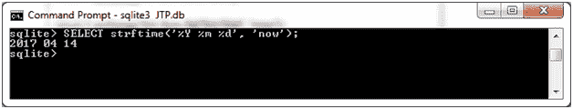 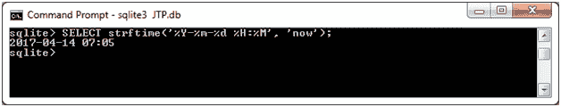

**示例 2:检索每月的第一天:**

```

SELECT strftime('%Y-%m-%d', '2017-04-14', 'start of month');
SELECT strftime('%Y-%m-%d', 'now', 'start of month');
SELECT strftime('%Y-%m-%d', '2017-03-07', '-6 days');
SELECT strftime('%Y-%m-%d', 'now', '-13 days');

```

输出:

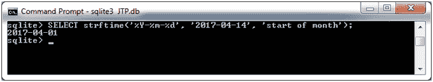 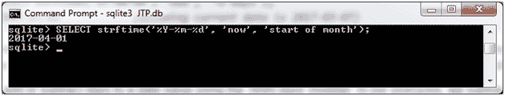 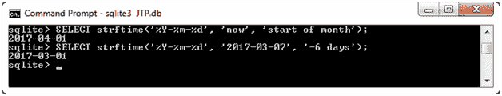 

**示例 2:检索一个月的最后一天:**

```

SELECT strftime('%Y-%m-%d', '2017-03-07', 'start of month', '+1 month', '-1 day'); 
SELECT strftime('%Y-%m-%d', 'now', 'start of month', '+1 month', '-1 day');
SELECT strftime('%Y-%m-%d', '2017-03-07', '+24 days');
SELECT strftime('%Y-%m-%d', 'now', '+24 days');

```

输出:

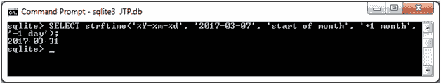 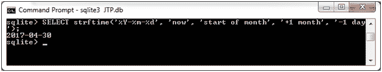 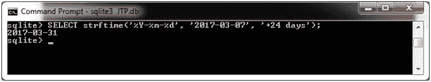 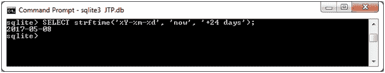

**示例 3:加/减年和日:**

```

SELECT strftime('%Y-%m-%d', '2017-04-14', '+2 years');
SELECT strftime('%Y-%m-%d', 'now', '-2 years');
SELECT strftime('%Y-%m-%d', '2017-04-14', '+7 days');
SELECT strftime('%Y-%m-%d', 'now', '-10 days'); 

```

输出:

 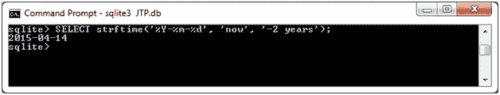 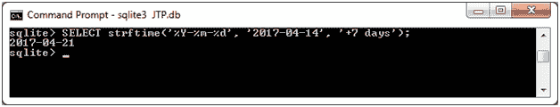 

* * *