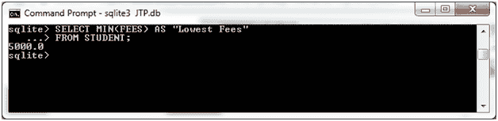
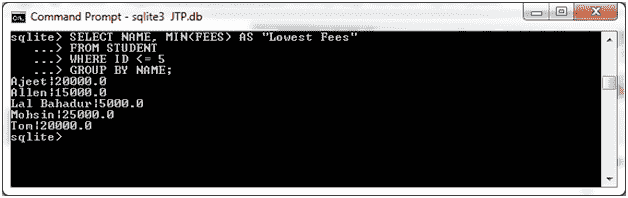

# 最小平方函数

> 原文：<https://www.javatpoint.com/sqlite-min>

SQLite MIN 函数用于获取表达式的最小值。

**语法:**

```sql

SELECT MIN(aggregate_expression)
FROM tables
[WHERE conditions]; 

```

**在 GROUP BY 子句中使用 Min 函数时的语法:**

```sql

SELECT expression1, expression2, ... expression_n
MIN(aggregate_expression)
FROM tables
[WHERE conditions]
GROUP BY expression1, expression2, ... expression_n; 

```

**示例 1:**

我们有一个名为“STUDENT”的表，它包含以下数据:


从“学生”表中检索学生的最低费用:

```sql

SELECT MIN(FEES) AS "Lowest Fees"
FROM STUDENT; 

```

输出:



**示例 2:**

**使用带最小函数的 GROUP BY 子句:**

从“学生”表中检索姓名和最低费用，并按姓名按数据排序:

```sql

SELECT NAME, MIN(FEES) AS "Lowest Fees"
FROM STUDENT
WHERE ID <= 5
GROUP BY NAME; 

```

输出:



* * *