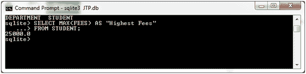
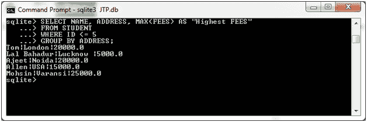

# SQLite 最大函数

> 哎哎哎:# t0]https://www . javatppoint . com/SQLite-max

SQLite MAX 函数用于获取表达式的最大值。

**语法:**

```

SELECT MAX(aggregate_expression)
FROM tables
[WHERE conditions]; 

```

**在 GROUP BY 子句中使用 MAX 函数时的语法:**

```

SELECT expression1, expression2, ... expression_n
MAX(aggregate_expression)
FROM tables
[WHERE conditions]
GROUP BY expression1, expression2, ... expression_n; 

```

**示例 1:**

我们有一个名为“STUDENT”的表，它包含以下数据:


从“学生”表中检索学生的最高费用。

输出:



**示例 2:**

**使用带 MAX 函数的 GROUP BY 子句:**

从“学生”表中检索姓名、城市和最高费用，并按城市按数据排序:

```

SELECT NAME, ADDRESS, MAX(FEES) AS "Highest FEES"
FROM STUDENT
WHERE ID <= 5
GROUP BY ADDRESS;

```

输出:



* * *