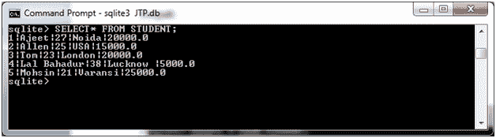
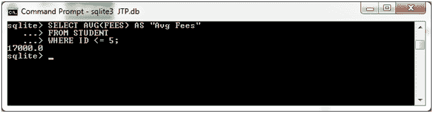
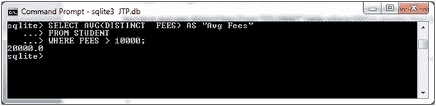
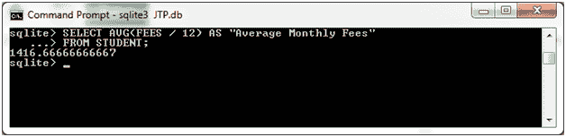
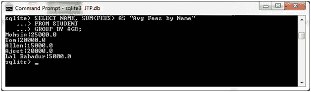

# SQLite AVG 函数

> 原文：<https://www.javatpoint.com/sqlite-avg>

SQLite AVG 函数用于检索表达式的平均值。

**语法:**

```sql

SELECT AVG(aggregate_expression)
FROM tables
[WHERE conditions]; 

```

**在 GROUP BY 子句中使用 AVG 函数时的语法:**

```sql

SELECT expression1, expression2, ... expression_n
AVG(aggregate_expression)
FROM tables
[WHERE conditions]
GROUP BY expression1, expression2, ... expression_n; 

```

**示例 1:**

我们有一个名为“STUDENT”的表，它包含以下数据:



在“学生”表中检索所有学生的平均费用。

```sql

SELECT AVG(FEES) AS "Avg Fees"
FROM STUDENT
WHERE ID <= 5; 

```

输出:



**示例 2:使用带有 AVG 函数的 DISTINCT 子句**

从费用大于 10000 的“学生”表中检索不同费用的平均值。

```sql

SELECT AVG(DISTINCT  FEES) AS "Avg Fees"
FROM STUDENT
WHERE FEES > 10000; 

```

输出:



**例 3:使用带有 AVG 函数的数学公式**

您可以根据需要使用数学公式来检索平均值:

```sql

SELECT AVG(FEES / 12) AS "Average Monthly Fees"
FROM STUDENT;

```

输出:



**示例 4:使用带有 AVG 函数的 GROUP BY 子句**

从表格中检索姓名和费用，并按年龄分组结果:

```sql

SELECT NAME, SUM(FEES) AS "Avg Fees by Name"
FROM STUDENT
GROUP BY AGE;

```

输出:



* * *