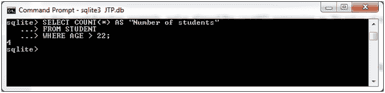
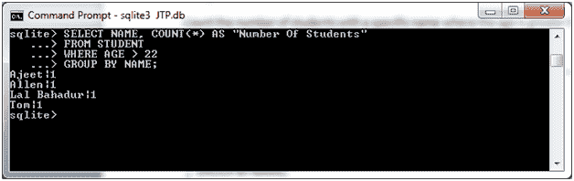

# SQLite 计数函数

> 原文：<https://www.javatpoint.com/sqlite-count>

SQLite COUNT 函数用于获取表达式的总计数。

**语法:**

```sql

SELECT COUNT(aggregate_expression)
FROM tables
[WHERE conditions]; 

```

**在 GROUP BY 子句中使用 MAX 函数时的语法:**

```sql

SELECT expression1, expression2, ... expression_n
COUNT(aggregate_expression)
FROM tables
[WHERE conditions]
GROUP BY expression1, expression2, ... expression_n; 

```

**示例 1:**

我们有一个名为“STUDENT”的表，它包含以下数据:


统计“学生”表中年龄大于 22 岁的学生人数。

```sql

SELECT COUNT(*) AS "Number of students"
FROM STUDENT
WHERE AGE > 22;

```

输出:



**示例 2:**

**使用带计数功能的 GROUP BY 子句:**

统计年龄大于 22 岁的特定姓名的学生人数，并按姓名分组。

```sql

SELECT NAME, COUNT(*) AS "Number Of Students"
FROM STUDENT
WHERE AGE > 22
GROUP BY NAME;

```

输出:



* * *