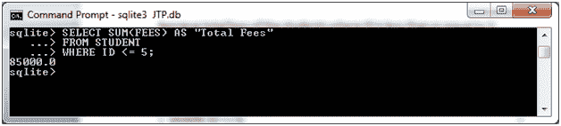
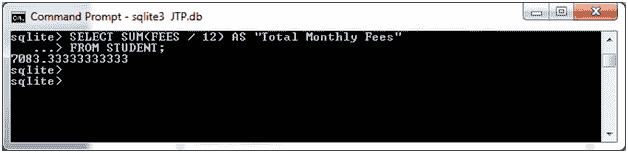
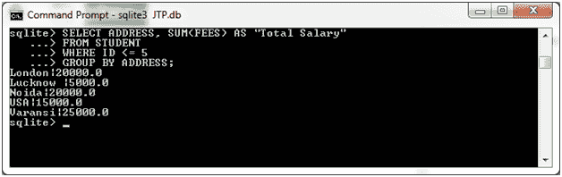

# SQLite 求和函数

> 原文：<https://www.javatpoint.com/sqlite-sum>

SQLite SUM 函数用于返回表达式的求和值。

**语法:**

```sql

SELECT SUM(aggregate_expression)
FROM tables
[WHERE conditions]; 

```

**在 GROUP BY 子句中使用 SUM 函数时的语法:**

```sql

SELECT expression1, expression2, ... expression_n
SUM(aggregate_expression)
FROM tables
[WHERE conditions]
GROUP BY expression1, expression2, ... expression_n;

```

**示例 1:**

我们有一个名为“STUDENT”的表，它包含以下数据:


检索 ID 小于或等于 5 的学生的总费用:

```sql

SELECT SUM(FEES) AS "Total Fees"
FROM STUDENT
WHERE ID <= 5; 

```

输出:



**例 2:使用带求和函数的数学公式**

可以使用带有 SUM 函数的数学公式。

```sql

SELECT SUM(FEES / 12) AS "Total Monthly Fees"
FROM STUDENT;

```

输出:



**示例 2:使用带 SUM 函数的 GROUP BY 子句:**

从“学生”表中检索地址，找到相应费用的总和，并按地址分组。

```sql

SELECT ADDRESS, SUM(FEES) AS "Total Salary"
FROM STUDENT
WHERE ID <= 5
GROUP BY ADDRESS;

```

输出:



* * *