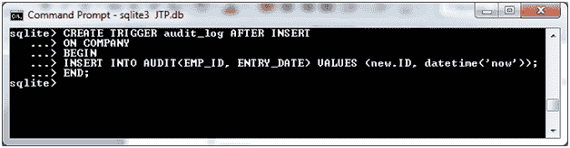
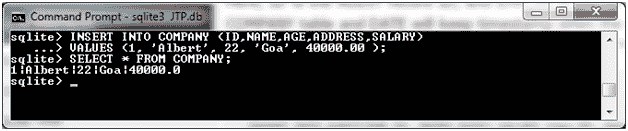
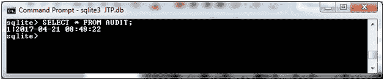
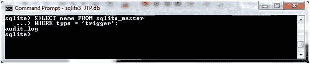
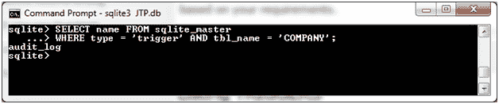
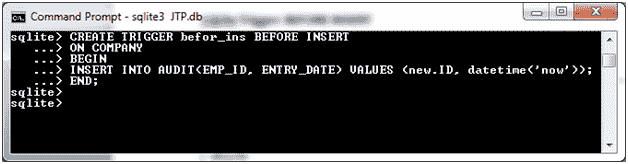
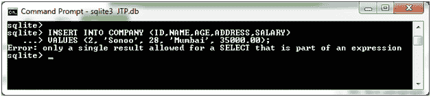
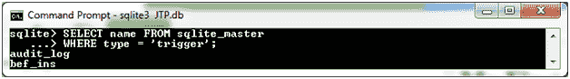

# SQLite 触发器:插入后/插入前

> 原文：<https://www.javatpoint.com/sqlite-trigger-after-insert>

它指定如何在插入数据后创建触发器。假设我们有两个表“公司”和“审计”，这里我们希望为插入到新创建的“公司”表中的每个记录保留审计试验。如果您已经有一个“公司”表，请删除它并重新创建。

**公司表:**

```sql

CREATE TABLE COMPANY(
   ID INT PRIMARY KEY     NOT NULL,
   NAME           TEXT    NOT NULL,
   AGE            INT     NOT NULL,
   ADDRESS        CHAR(50),
   SALARY         REAL
);

```

创建一个名为 AUDIT 的新表，每当公司表中有新记录的条目时，将在该表中插入日志消息:

**审核表:**

```sql

CREATE TABLE AUDIT(
    EMP_ID INT NOT NULL,
    ENTRY_DATE TEXT NOT NULL
); 

```

**插入后创建触发器:**

插入操作后，使用以下语法在公司表中创建名为“audit_log”的触发器。

```sql

CREATE TRIGGER audit_log AFTER INSERT 
ON COMPANY
BEGIN
INSERT INTO AUDIT(EMP_ID, ENTRY_DATE) VALUES (new.ID, datetime('now'));
END;

```

这里，标识是审计记录标识，EMP_ID 是来自公司表的标识，日期是在公司表中创建记录时的时间戳。



现在在公司表中插入一些记录，它将在审计表中创建一个审计日志记录。

```sql

INSERT INTO COMPANY (ID,NAME,AGE,ADDRESS,SALARY)
VALUES (1, 'Albert', 22, 'Goa', 40000.00);

```



同时，将在审核表中创建一条记录。这只是因为触发器，它是我们在公司表的 INSERT 操作中创建的。让我们看看审计表。

```sql

SELECT * FROM AUDIT; 

```



**如何列出触发器**

您可以使用 sqlite_master 语句列出触发器。

```sql

SELECT name FROM sqlite_master
WHERE type = 'trigger'; 

```

输出:



您可以看到触发器的名称。

您也可以使用 AND 子句在特定的表上列出触发器。

```sql

SELECT name FROM sqlite_master
WHERE type = 'trigger' AND tbl_name = 'COMPANY';  

```



* * *

# SQLite 触发器:在插入之前

如果要在插入数据之前创建触发器:

```sql

CREATE TRIGGER befor_ins BEFORE INSERT 
ON COMPANY
BEGIN
INSERT INTO AUDIT(EMP_ID, ENTRY_DATE) VALUES (new.ID, datetime('now'));
END;

```



```sql

INSERT INTO COMPANY (ID,NAME,AGE,ADDRESS,SALARY)
VALUES (2, 'Sonoo', 28, 'Mumbai', 35000.00); 

```

您可以看到触发器已经创建，因此您不能插入记录。



**检查创建的触发器:**



在这里，您可以看到两个创建的触发器。

* * *