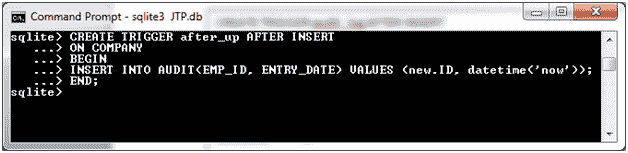
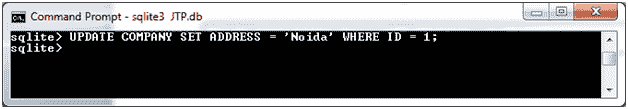
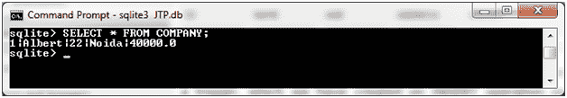
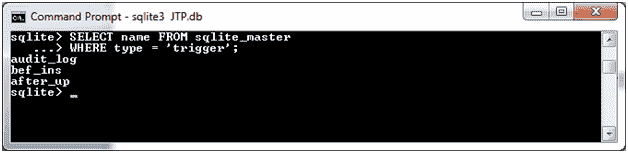
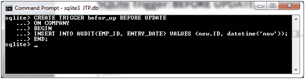
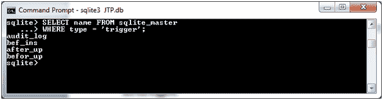

# SQLite 触发器:更新后

> 原文：<https://www.javatpoint.com/sqlite-trigger-after-update>

它指定如何在更新数据后创建触发器。假设我们有两个表“公司”和“审计”，这里我们希望为“公司”表中更新的每条记录保留审计试验。

**公司表:**

```

CREATE TABLE COMPANY(
   ID INT PRIMARY KEY     NOT NULL,
   NAME           TEXT    NOT NULL,
   AGE            INT     NOT NULL,
   ADDRESS        CHAR(50),
   SALARY         REAL
);

```

创建一个名为“审计”的新表，每当“公司”表发生更新时，将在该表中插入日志消息。

**审核表:**

```

CREATE TABLE AUDIT(
    EMP_ID INT NOT NULL,
    ENTRY_DATE TEXT NOT NULL
); 

```

**更新后创建触发器:**

更新操作后，使用以下语法在公司表中创建名为“after_up”的触发器。

```

 CREATE TRIGGER after_up AFTER UPDATE 
ON COMPANY
BEGIN
INSERT INTO AUDIT(EMP_ID, ENTRY_DATE) VALUES (new.ID, datetime('now'));
END;

```



现在更新旧记录如下:

```

UPDATE COMPANY SET ADDRESS = 'Noida' WHERE ID = 1; 

```



**见结果:**



**见触发器:**

```

SELECT name FROM sqlite_master
WHERE type = 'trigger'; 

```



* * *

# SQLite 触发器:更新前

如果要在更新数据之前创建触发器:

```

CREATE TRIGGER befor_up BEFORE UPDATE 
ON COMPANY
BEGIN
INSERT INTO AUDIT(EMP_ID, ENTRY_DATE) VALUES (new.ID, datetime('now'));
END;

```



**参见触发器:**

```

SELECT name FROM sqlite_master
WHERE type = 'trigger';      

```



* * *