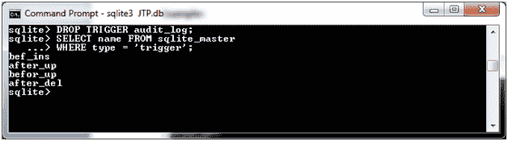

# SQLite DROP TRIGGER

> 原文：<https://www.javatpoint.com/sqlite-drop-trigger>

在 SQLite 中，DROP TRIGGER 命令用于从表中删除触发器。

**语法:**

```sql

DROP TRIGGER trigger_name; 

```

**示例:**

参见给定的示例。它有 5 个触发器:


让我们删除名为“audit_log”的触发器。

```sql

DROP TRIGGER audit_log; 

```

现在你可以看到“audit_log”被删除了。



* * *