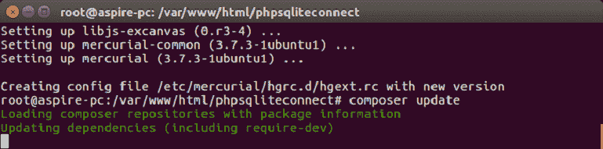
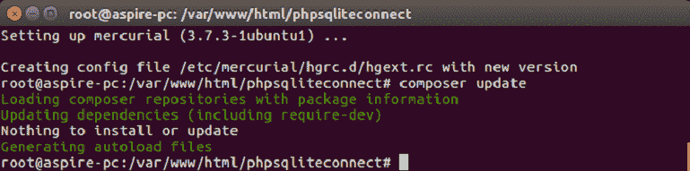
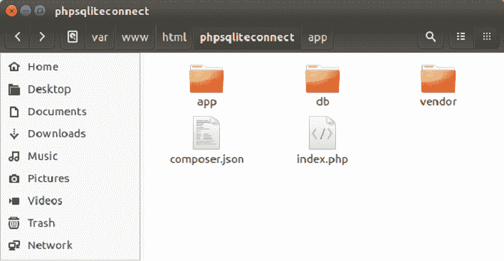
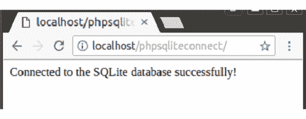
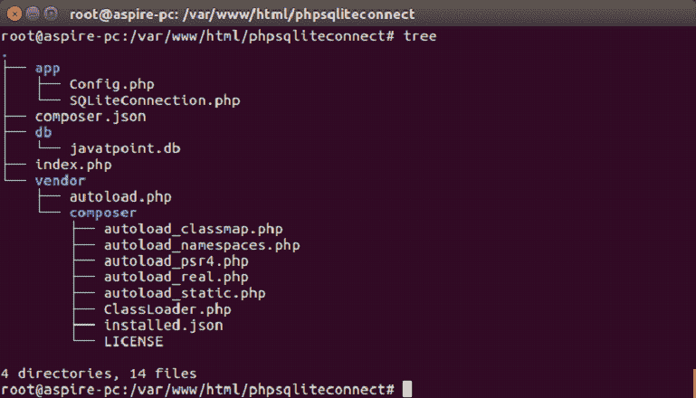

# 用 PHP 连接 SQLite

> 原文：<https://www.javatpoint.com/php-sqlite>

要用 PHP 连接 SQLite 数据库，必须在系统上安装 PHP 和 SQLite。

如果没有安装 sqlite，首先使用以下命令安装 sqlite:

```sql
sudo apt-get install sqlite3 libsqlite3-dev

```

## 安装 Sqlite-php 连接驱动程序

```sql
sudo apt install php-sqlite3 

```

系统地遵循以下步骤:

*   在 www 目录中创建一个文件夹“phpsqliteconnect”。
*   在“phpsqliteconnect”中创建两个子文件夹“app”和“db”。
*   在“phpsqliteconnect”中创建一个 JSON 文件“composer.json”，代码如下:

```sql
{
    "autoload": {
        "psr-4": {
            "App\\": "app/"
        }
    }
}

```

打开命令提示符，转到 phpsqliteconnect 并执行以下代码:

```sql
composer update

```



现在，您将收到以下消息:



#### 注意:编写器将自动创建一个名为“供应商”的新文件夹。

如果没有安装 composer，那么首先安装 composer

```sql
apt install composer

```

现在在根文件夹“phpsqliteconnect”中创建一个文件名“index.php”，代码如下:

```sql
<?php
require 'vendor/autoload.php';
</textarea></div>
<hr/>
<h2 class="h2">Establish connection with SQLite database</h2>
<p>Create a new file "Config.php" inside the app folder, having the following code:</p>
<div class="codeblock"><textarea name="code" class="php">
<?php

namespace App;

class Config {
   /**
    * path to the sqlite file
    */
    const PATH_TO_SQLITE_FILE = 'db/javatpoint.db';

}

```

常量 PATH_TO_SQLITE_FILE 用于存储数据库文件夹中的 SQLITE 数据库文件的路径。

现在，创建一个新的 SQLiteConnection 文件，并添加如下所示的 SQLiteConnection 类:

```sql
<?php
namespace App;

/**
 * SQLite connnection
 */
class SQLiteConnection {
    /**
     * PDO instance
     * @var type 
     */
    private $pdo;

    /**
     * return in instance of the PDO object that connects to the SQLite database
     * @return \PDO
     */
    public function connect() {
        if ($this->pdo == null) {
            $this->pdo = new \PDO("sqlite:" . Config::PATH_TO_SQLITE_FILE);
        }
        return $this->pdo;
    }
}

```

将所有类放置到位后，使用以下命令生成自动加载文件:

```sql
composer dump-autoload -o

```

```sql
<?php

ini_set('display_errors', 1);
error_reporting(E_ALL ^ E_NOTICE);

require 'vendor/autoload.php';

use App\SQLiteConnection;

$pdo = (new SQLiteConnection())->connect();
if ($pdo != null)
    echo 'Connected to the SQLite database successfully!';
else
    echo 'Whoops, could not connect to the SQLite database!';

?>

```



现在，打开浏览器**的本地主机**



连接已成功建立。您也可以通过使用 tree 命令来查看树结构:

