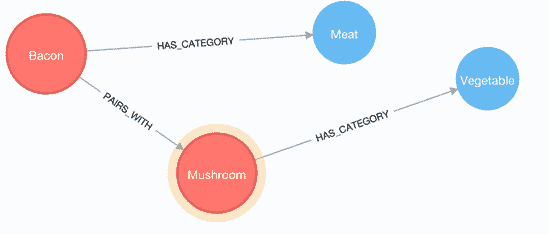

# Neo4j 数据模型

> 原文：<https://www.javatpoint.com/neo4j-data-modelling>

Neo4j 数据库遵循属性图模型来存储和管理其数据。Neo4j 是一个图形数据库，包含属性图形模型的以下特征。

*   图形模型包含指定数据及其操作的节点、关系和属性。
*   属性是键值对。
*   节点用圆圈表示，关系用箭头键表示。关系指定两个节点之间的关系。
*   根据节点的方向，节点之间有两种类型的关系:单向和双向
*   每个关系包含两个节点:“开始节点”或“从节点”和“到节点”或“结束节点”。
*   节点和关系都包含属性。

在属性图数据模式中，关系应该是有方向的。如果你创建一个没有方向的关系，它会通过一个错误消息。

GraphDB 数据模型有三个主要构建块:

*   节点
*   关系
*   性能

