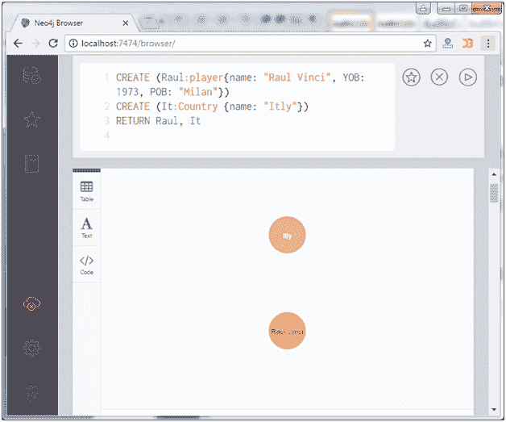
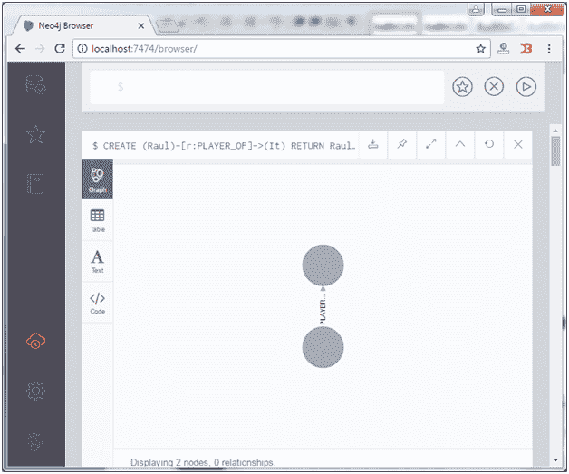
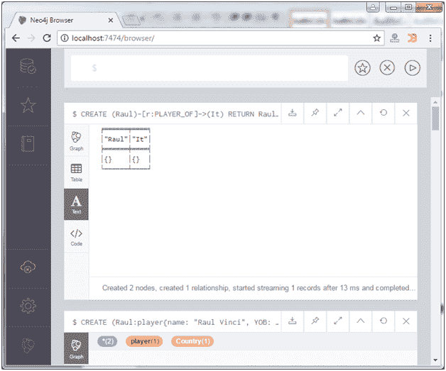
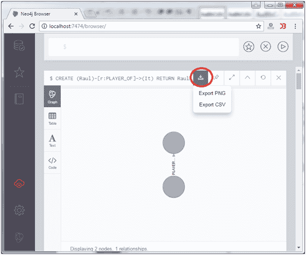
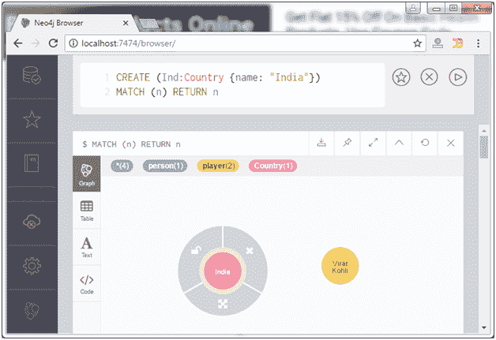
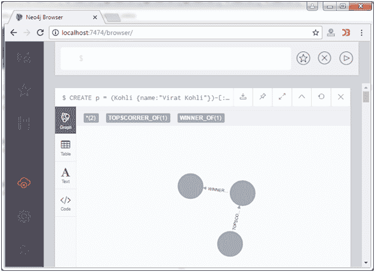

# 建立联系

> 原文：<https://www.javatpoint.com/neo4j-create-relationships>

CREATE 语句用于创建节点之间的关系。这些关系定义了数据的方向、类型和形式模式。

它主要定义了三件事:

*   创建关系
*   创建现有节点之间的关系
*   使用标签和属性创建关系

## 创建关系

创建关系时，应根据关系在连字符“-”和箭头“？”之间的方向，在方括号“]”中指定关系如以下语法所示。

**语法:**

```

CREATE (node1)-[:RelationshipType]->(node2) 

```

**例**

让我们先创建两个节点“劳尔”和“它”，然后指定它们之间的关系。

```

CREATE (Raul:player{name: "Raul Vinci", YOB: 1973, POB: "Milan"}) 
CREATE (It:Country {name: "Itly"}) 
RETURN Raul, It

```



现在在这两个节点之间创建一个关系“PLAYER_OF”为？

```

CREATE (Raul)-[r:PLAYER_OF]->(It)
RETURN Raul, It 

```

输出:



您也可以以表格或文本形式查看它:

 

您也可以下载(导出)想要保存的图形格式。点击下载按钮，查看示例:



* * *

## 在现有节点之间创建关系

MATCH 语句用于创建现有节点之间的关系。

**语法:**

```

MATCH (a:LabeofNode1), (b:LabeofNode2) 
WHERE a.name = "nameofnode1" AND b.name = " nameofnode2" 
CREATE (a)-[: Relation]->(b) 
RETURN a,b 

```

**例**

使用 MATCH 语句创建关系。

```

MATCH (a:player), (b:Country) WHERE a.name = "Raul Vinci" AND b.name = "Itly" 
CREATE (a)-[r: FOOTBALLER_OF]->(b) 
RETURN a,b 

```

输出:


* * *

## 使用标签和属性创建关系

CREATE 语句用于创建带有标签和属性的关系。

**语法:**

```

CREATE (node1)-[label:Rel_Type {key1:value1, key2:value2, . . . n}]-> (node2)

```

**示例:**

让我们举一个例子，使用 create 语句为带有标签和属性的节点创建一个关系。

首先创建一个具有多个标签的节点“Kohli”

```

CREATE (Kohli:person:player)

```

然后用相同的节点创建一些属性:

```

CREATE (Kohli:player{name: "Virat Kohli", YOB: 1988, POB: "Delhi"}) 
RETURN Kohli 

```


创建另一个节点“Ind”:

```

CREATE (Ind:Country {name: "India"})

```



现在用标签和属性创建一个关系:

```

MATCH (a:player), (b:Country) WHERE a.name = "Virat Kohli" AND b.name = "India" 
CREATE (a)-[r:BATSMAN_OF {Matches:5, Avg:90.75}]->(b)  
RETURN a,b

```


* * *

## 创建完整的路径

在 Neo4j 中，CREATE 语句用于创建路径。使用连续关系形成路径。

**语法:**

```

CREATE p = (Node1 {properties})-[:Relationship_Type]->
(Node2 {properties})[:Relationship_Type]->(Node3 {properties}) 
RETURN p 

```

**示例:**

首先创建一个名为“冠军奖杯”的节点 3 来做进一步的操作。


现在执行以下代码:

```

CREATE p = (Kohli {name:"Virat Kohli"})-[:TOPSCORRER_OF]->
(Ind {name: "India"})-[: WINNER_OF]->(Node3 {CT: "Champions_Trophy"}) 
RETURN p

```

