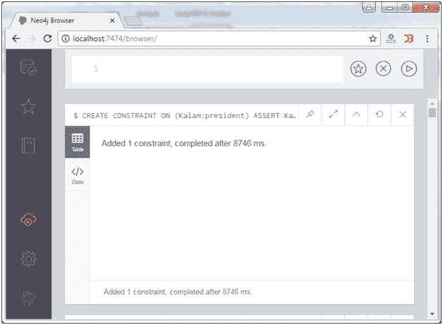
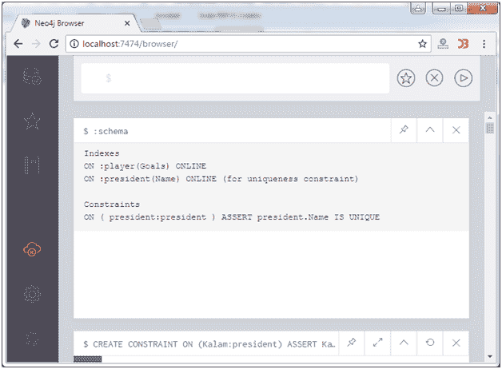

# Neo4j 创建约束

> 原文：<https://www.javatpoint.com/neo4j-create-a-constraint>

在 Neo4j 中，约束用于对可以针对节点或关系输入的数据进行限制。

Neo4j 中有两种类型的约束:

**唯一性约束:**指定属性必须包含唯一值。(例如:没有两个带有玩家标签的节点可以共享“目标”属性的值。)

**属性存在约束:**它确保具有特定标签的所有节点或具有特定类型的所有关系都存在一个属性。

* * *

## 创建唯一性约束

**在**上创建约束语句用于在 Neo4j 中创建唯一性约束。

```sql

CREATE CONSTRAINT ON (Kalam:president) ASSERT Kalam.Name IS UNIQUE 

```

输出:



## 确认

使用**:模式**命令检查约束。

```sql

:schema

```



* * *

## 属性存在约束

属性存在约束用于确保具有某个标签的所有节点都具有某个属性。

#### 注意:现有属性约束仅在 Neo4j 企业版中可用。