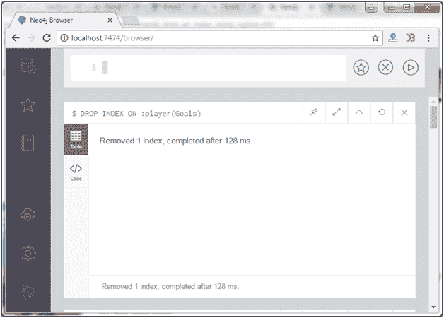
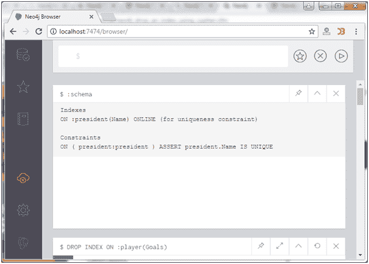

# Neo4j 删除一个索引

> 原文：<https://www.javatpoint.com/neo4j-drop-an-index>

在 Neo4j 中，“删除索引打开”语句用于从数据库中删除索引。它将从数据库中永久删除索引。

**示例:**

```sql

DROP INDEX ON :player(Goals) 

```



正如你在上面的截图中看到的，索引被移除了。

## 确认

**:模式**命令用于验证适用的索引已经从模式中删除。



您可以看到索引已经不在模式中了。