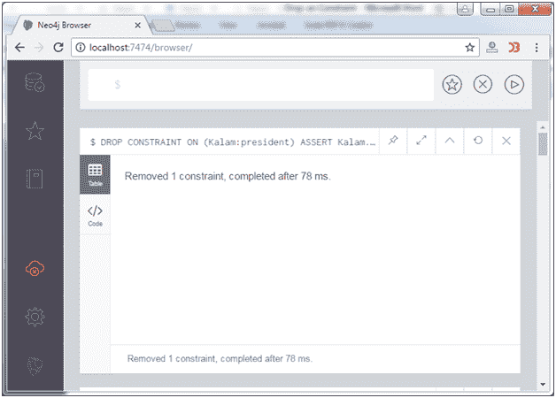
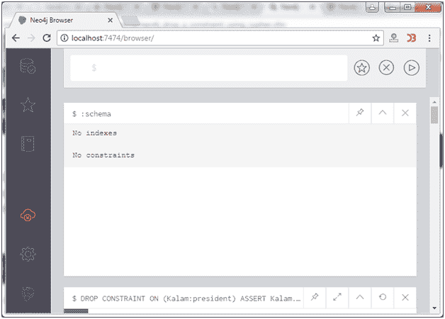

# Neo4j 删除约束

> 原文：<https://www.javatpoint.com/neo4j-drop-constraint>

DROP CONSTRAINT 语句用于从数据库及其关联索引中删除约束。

**示例:**

使用以下语句删除以前创建的约束及其关联的索引，

```sql

DROP CONSTRAINT ON (Kalam:president) ASSERT Kalam.Name IS UNIQUE 

```



约束已成功移除。

## 确认

**:schema** 语句用于验证适用的约束及其关联的索引是否已经从 schema 中移除。

输出:

