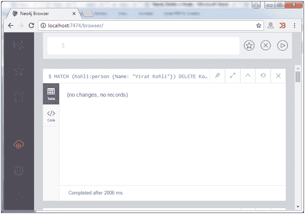
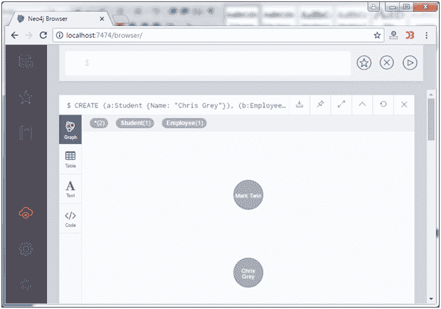
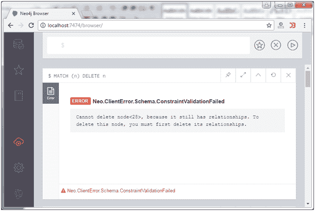

# Neo4j 删除节点

> 原文：<https://www.javatpoint.com/neo4j-delete-a-node>

在 Neo4j 中，DELETE 语句总是与 MATCH 语句一起使用，以删除匹配的任何数据。DELETE 命令的用法与我们在前面的例子中使用 RETURN 子句的用法相同。

**例**

```

MATCH (Kohli:person {Name: "Virat Kohli"}) DELETE Kohli

```



* * *

## 删除多个节点

您可以在一条语句中使用 MATCH 和 delete 命令删除多个节点。你只需要把不同的节点用一列隔开。

假设您有这两个节点:



使用以下命令删除这两个节点。

```

MATCH (a:Student {Name: "Chris Grey"}), (b:Employee {Name: "Mark Twin"}) 
DELETE a,b

```


您可以看到上面显示的消息，两个节点都已被删除。

* * *

## 删除所有节点

从数据库中删除所有节点，唐？不要使用任何过滤标准。

```

MATCH (n) DELETE n

```

#### 注意:上面的语句不能删除有任何关系的节点。换句话说，在删除节点本身之前，必须删除任何关系。否则，您将收到以下错误消息。



有一种方法可以删除一个节点以及与该节点相关的所有关系。

使用 DETACH DELETE 语句:

**示例:**

```

MATCH (Kohli:player{name: "Virat Kohli"}) DETACH DELETE Kohli

```

输出:


这将删除名为“Virat Kohli”的节点“Kohli”及其所有关系。