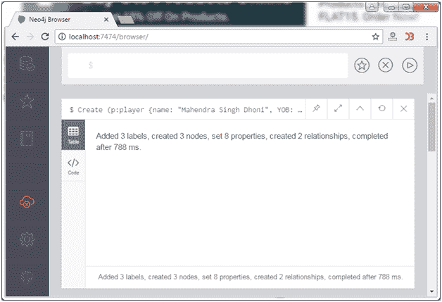
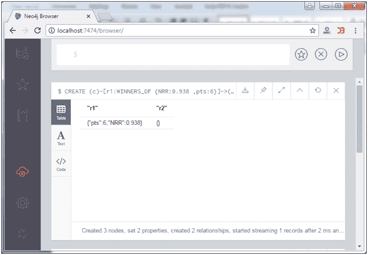

# Neo4j -退货条款

> 原文：<https://www.javatpoint.com/neo4j-return-clause>

在 Neo4j 中，RETURN 子句用于返回节点、关系和属性。通过使用 RETURN 子句，您可以获得以下内容:

*   返回单个节点。
*   返回多个节点。
*   回报关系。
*   返回属性。
*   返回所有元素。

* * *

## 返回单个节点

**语法:**

```
Create (node:label {properties}) 
RETURN node 

```

**示例:**

在继续示例之前，首先创建一些节点和关系。

```
Create (p:player {name: "Mahendra Singh Dhoni", YOB: 1981, POB: "Ranchi"}) 
CREATE (c:Country {name: "India", result: "Winners"}) 
CREATE (CT2013:Tornament {name: "ICC Champions Trophy 2013"}) 
CREATE (c)-[r1:WINNERS_OF {NRR:0.938 ,pts:6}]->(CT2013) 
CREATE(p)-[r2:CAPTAIN_OF]->(c) 

```

这将创建 3 个节点和 2 个关系。



现在返回单个节点。

```
Create (p:player {name: "Mahendra Singh Dhoni", YOB: 1981, POB: "Ranchi"}) 
RETURN p 

```

输出:


* * *

## 返回多个节点

**语法:**

```
Create (node1:label {properties}) 
Create (node2:label {properties}) 
.
.
Create (node N:label {properties}) 
RETURN node1, node2.... node N 

```

**示例:**

让我们返回两个节点 c 和 CT2013

```
CREATE (c:Country {name: "India", result: "Winners"}) 
CREATE (CT2013:Tornament {name: "ICC Champions Trophy 2013"}) 
RETURN c, CT2013 

```

输出:


* * *

## 退货关系

**语法:**

```
CREATE (node1)-[Relationship:Relationship_type]->(node2) 
RETURN Relationship 

```

**示例:**

请看这个创建两个关系并返回它们的例子。

```
CREATE (c)-[r1:WINNERS_OF {NRR:0.938 ,pts:6}]->(CT2013) 
CREATE(p)-[r2:CAPTAIN_OF]->(c) 
RETURN r1, r2 

```

输出:



* * *

## 返回属性

**语法:**

```
Match (node:label {properties . . . . . . . . . . }) 
Return node.property 

```

**示例:**

让我们返回节点 p 的属性。

```
Match (p:player {name: "Mahendra Singh Dhoni", YOB: 1981, POB: "Ranchi"}) 
Return p.name, p.POB 

```

输出:


* * *

## 返回所有元素

**示例:**

```
Match m = (n {name: "India", result: "Winners"})-[r]-(x)  
RETURN * 

```

输出:

