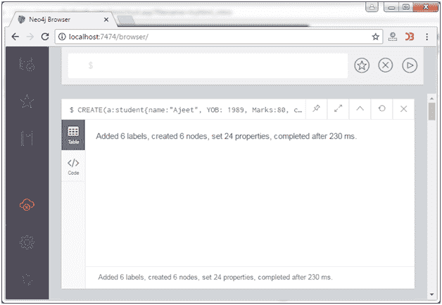
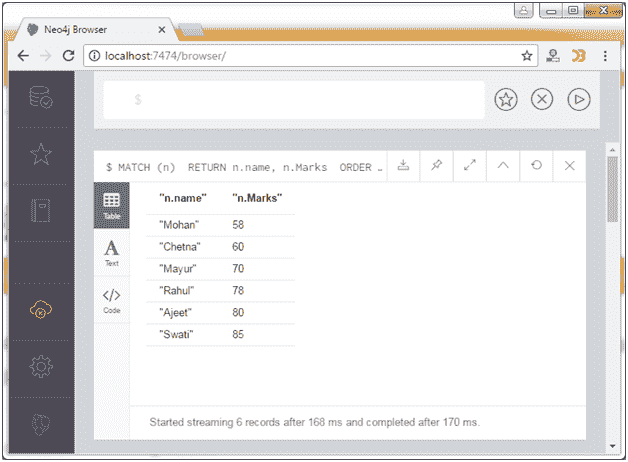
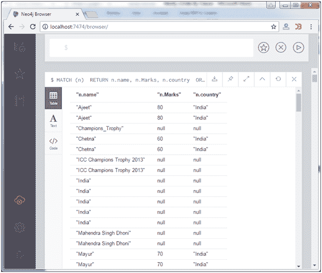
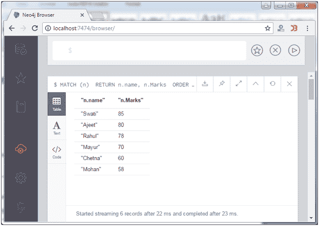

# Neo4j 按条款排序

> 原文：<https://www.javatpoint.com/neo4j-order-by-clause>

在 Neo4j 中，ORDER BY 子句用于按顺序排列结果数据。

**语法:**

```
MATCH (n)  
RETURN n.property1, n.property2 . . . . . . . .  
ORDER BY n.property 

```

让我们在 Neo4j 数据库中创建一些节点。

```
CREATE(a:student{name:"Ajeet", YOB: 1989, Marks:80, country: "India"})
CREATE(b:student{name:"Mayur", YOB: 1990, Marks:70, country: "India"})
CREATE(c:student{name:"Chetna", YOB: 1991, Marks:60, country: "India"})
CREATE(d:student{name:"Rahul", YOB: 1992, Marks:78, country: "India"})
CREATE(e:student{name:"Mohan", YOB: 1993, Marks:58, country: "India"})
CREATE(f:student{name:"Swati", YOB: 1994, Marks:85, country: "India"})

```

输出:



您可以看到创建了 6 个节点。

```
MATCH (n)  
RETURN n.name, n.Marks 
ORDER BY n.Marks 

```

输出:



* * *

## 按多个属性排序节点

ORDER BY 子句用于根据多个属性排列节点。

**语法:**

```
MATCH (n) 
RETURN n 
ORDER BY n.property_1, n.property_2 

```

**示例:**

```
MATCH (n) 
RETURN n.name, n.Marks, n.country 
ORDER BY n.name, n.Marks

```

输出:



* * *

## 按降序排列节点

**语法:**

```
MATCH (n) 
RETURN n 
ORDER BY n.property DESC 

```

现在按降序排列数据库的节点:

```
MATCH (n)  
RETURN n.name, n.Marks 
ORDER BY n.Marks DESC

```

输出:

